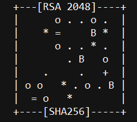
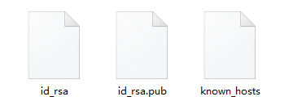

# 创建 *SSH Key*

## 1. 输入命令

- 命令格式：`ssh-keygen -t rsa -C "abc@email.com"`

- 命令说明：*C* 是大写

- 我的操作
    - 假设我的邮箱地址是 *york@email.com*

    > $ ssh-keygen -t rsa -C "york@email.com"

- 命令反馈
    - `Enter passphrase (empty for no pass phrase):`
    - `Enter same passphrase again:`
- 反馈说明
    - 若没有特别要求，直接回车即可
    - 回车后会打印出一张 *randomart image*，类似这种

    

## 2. 复制公钥

- 此时 `C:\Users\xxx\` 下会有一个隐藏文件夹：`.ssh`

- 我进入 `C:\Users\york\.ssh`，里面有三个文件

    

- 说明

    - `id_rsa` 是私钥，不要泄露了
    - `id_rsa.pub` 是公钥，可以让他人知道

- 操作

    1. 打开 `id_rsa.pub`
    2. 复制里面的一堆文本