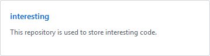
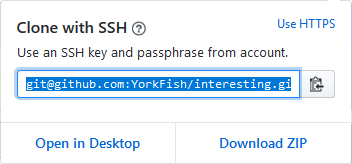

# 4. 克隆远程仓库

## 1. 克隆

1. 登入 GitHub
2. 点击右上角的头像
3. 点击 `Your profile`

    

4. 选择自己的某个远程仓库，比如，我选 `interesting`

    

5. 点击右侧的 <kbd>Clone or download</kbd>
6. 复制地址

    

7. 在本地选择一个目录进行克隆

    ```bash
    York@DESKTOP MINGW64 /d/git
    $ git clone git@github.com:YorkFish/interesting.git
    Cloning into 'interesting'...
    remote: Enumerating objects: 25, done.
    remote: Counting objects: 100% (25/25), done.
    remote: Comparessing objects: 100% (24/24), done.
    remote: Total 25 (delta 6), reused 0 (delta 0), pack-reused 0
    Receiving objects: 100% (25/25), 6.00 KiB | 219.00 KiB/s, done.
    Resolving deltas: 100% (6/6), done.
    ```

!!! tip
    可用此法克隆他人开源的仓库

## 2. 查看

1. 进入 `interesting`

    ```bash
    York@DESKTOP MINGW64 /d/git
    $ cd interesting/

    York@DESKTOP MINGW64 /d/git/interesting (master)
    $ 
    ```

2. 用 `git remote -v` 查看后可以发现：已经自动就关联上了

    ```bash
    York@DESKTOP MINGW64 /d/git/interesting (master)
    $ git remote -v
    origin  git@github.com:YorkFish/interesting.git (fetch)
    origin  git@github.com:YorkFish/interesting.git (push)
    ```
