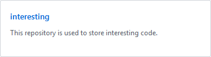

# 克隆远程仓库

## 1. 克隆远程仓库

1. 登入 *GitHub*

2. 点击右上角的头像

3. 点击 *Your profile*

    

4. 选择自己的某个远程仓库，比如，我选 *interesting*

    

5. 点击右侧的 <kbd>Clone or download</kbd>

6. 复制地址

    

7. 在本地选择一个目录进行克隆

    

- 补充
    - 可用此法克隆他人开源的仓库

## 2. 查看关联情况

- 进入 *interesting*

    

- 用 `git remote -v` 查看后可以发现：已经自动就关联上了

    