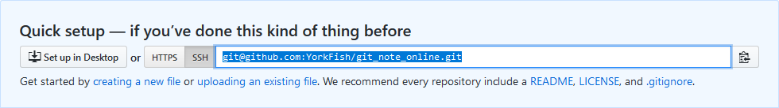

# 5. 本地仓库关联远程仓库

!!! info "情景说明"
    - 本地非空仓库名为 `git_note`
    - 远程新建仓库名为 `git_note_online`

## 1. 在 GitHub 上新建一个仓库

1. 登入账号后点击左侧上方的 <kbd>New</kbd>

    

2. 填入要新建的仓库名

    

3. 将页面拉到底部，点击 <kbd>Create repository</kbd>
4. 等页面跳转后，复制地址，下面要用

    

## 2. 在本地仓库设置 origin

1. 在本地打开目标仓库的文件夹
2. 右键，选择 `Git Bash Here`
3. 键入 `git remote add origin xxx`
    - `origin` 类似 Python 的 `self`，可以用别的词代替，但一般不作更改
    - `xxx` 指上面复制的地址
    - 这条命令可以这样理解：`origin = xxx`

```bash
York@DESKTOP MINGW64 /d/git/git_note (master)
$ git remote add origin git@github.com:YorkFish/git_note_online.git
```

## 3. 查看效果

- 使用 remote 命令

    ```bash
    York@DESKTOP MINGW64 /d/git/git_note (master)
    $ git remote
    origin

    York@DESKTOP MINGW64 /d/git/git_note (master)
    $ git remote -v
    origin  git@github.com:YorkFish/git_note_online.git (fetch)
    origin  git@github.com:YorkFish/git_note_online.git (push)
    ```
