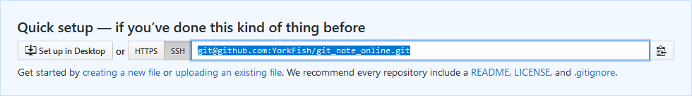

# 本地仓库关联远程仓库

## 1. 说明

- 本地仓库非空，取名为 `git_note`
- 远程仓库是新建的空仓库，取名为 `git_note_online`

## 2. 在 *GitHub* 上新建一个仓库

1. 登入账号后点击左侧上方的 <kbd>New</kbd>

2. 填入要新建的仓库名

3. 将页面拉到底部，点击 <kbd>Create repository</kbd>
4. 等页面跳转后，复制地址

    

## 3. 在本地仓库设置 *origin*

1. 在本地打开目标仓库的文件夹
2. 右键，选择 `Git Bash Here`
3. 键入 `git remote add origin xxx`
    - *origin* 可以用别的词代替
    - *xxx* 指 *2.4* 复制的地址
    - 这条命令相当于把地址赋值给变量 *origin*

    

4. 可以用 *remote* 命令查看效果

    