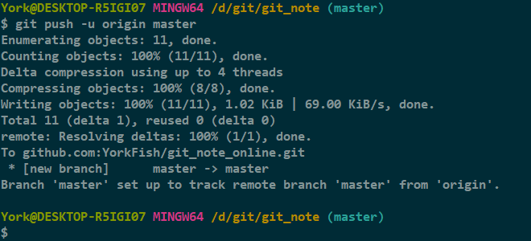
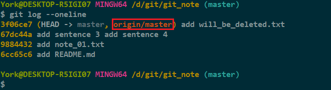

# 本地仓库向远程仓库推送

## 1. 推送命令

- `git push -u origin master`

    

## 2. 说明

- 第一次推送时需要加 `-u`

> 由于远程库是空的，我们第一次推送`master`分支时，加上了`-u`参数，Git不但会把本地的`master`分支内容推送的远程新的`master`分支，还会把本地的`master`分支和远程的`master`分支关联起来，在以后的推送或者拉取时就可以简化命令。[^1]

- 第二次及以后，再推送这个仓库中的内容时，不需要加 `-u` 了

## 3. 查看

- 使用命令：`git log --oneline`

- 查看时可发现版本号后面多了一串字

    

- 上图的 *origin/master* 表明：目前，远程仓库的 *master* 分支指向版本 *3f06ce7*

## 4. 补充

### 4.1 *GitHub* 上的地址

- 有两种地址，即，有两种加密传输方式

1. *https*
2. *SSH*

### 4.2 没有设置 *origin* 也能工作

- 方法：用具体的地址
    - `git push git@github.com:YorkFish/git_note_online.git`

### 4.3 可以删除 *origin*

- `git remote rm origin`

### 4.4 可以设置多个 *origin*

- 可以这样取名：*origin1*, *origin2*

[^1]: 摘自廖雪峰老师的Git教程
