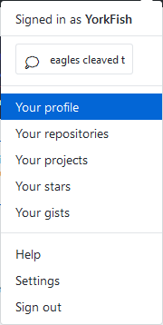
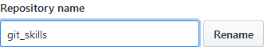
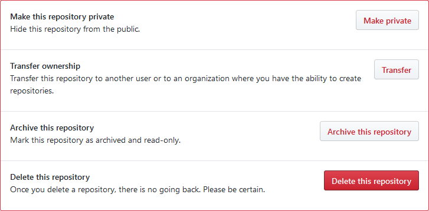
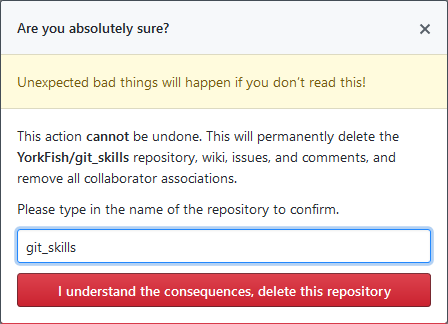
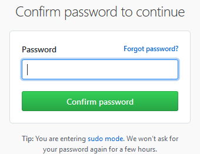

# 8. 删除远程仓库

## 1. 登录

1. 来到自己的 GitHub 页面
2. 点击右上角的头像
3. 点击 `Your profile`

    

## 2. 选择

1. 选择自己的某个远程仓库，如，我选 `git_skills`

    

2. 点击上方的 `Settings`

    

3. 题外话：改仓库名也在这里

    

## 3. 删除

1. 拉到最下方点击 <kbd>Delete this repository</kbd>

    

2. 跳出温馨提示窗口，在框中填入该仓库名并点击 <kbd>I understand the consequences, delete this repository</kbd>

    

3. 画面跳转，重新输一次登录密码以确认身份，并点击 <kbd>Confirm password to continue</kbd>

    

4. 删除完毕
