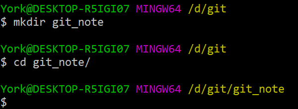
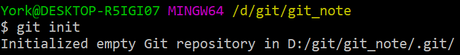
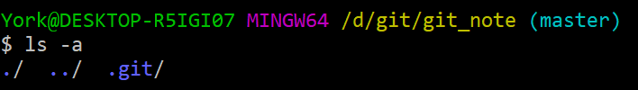

# 在本地建一个仓库

## 1. 选路径

- 方便起见，我
    1. 在 `D:/git` 下新建了一个`git_note` 文件夹
    2. 进入 `git_note`

    

## 2. 初始化

- 使用命令 `git init` 

    

- 至此，仓库已经建好了

## 3. 查看

- `git_note` 下新增了一个名为 `.git` 的隐藏文件夹
- 路径后多了一个 `(master)`

    