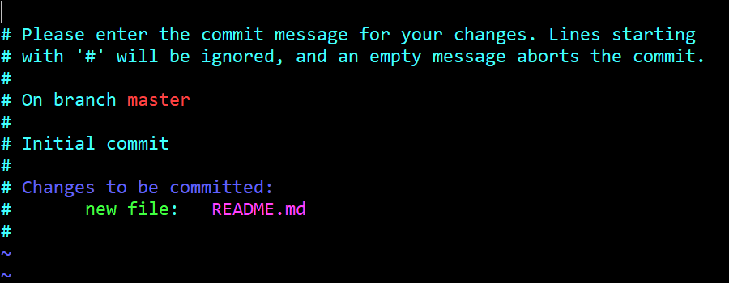
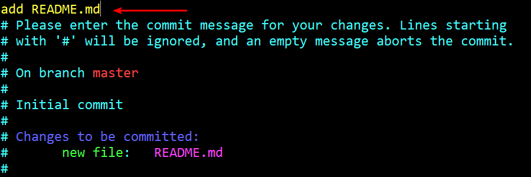

# 11. 向本地仓库添加文件

## 1. 准备工作

- 不妨新建一个 `README.md`

    ```bash
    York@DESKTOP MINGW64 /d/git/git_note (master)
    $ touch README.md

    York@DESKTOP MINGW64 /d/git/git_note (master)
    $ ls
    README.md
    ```

- 此时的 `README.md` 在工作区

## 2. 查看状态

```bash
York@DESKTOP MINGW64 /d/git/git_note (master)
$ git status
On branch master

No commits yet

Untracked files:
  (use "git add <file>..." to include in what will be commited)

        README.md

nothing added to commit but untracked files present (use "git add" to track)
```

!!! note "说明"
    - 当前分支为 `master` 分支
    - 目前还没进行过 `commit`
    - `README.md` 未被 **“追踪”**（此时的 <font color="red">README.md</font> 是红色的）
    - Git 提示：建议使用 `git add <file>` 来提交内容

## 3. 将文件加入暂存区

```bash
York@DESKTOP MINGW64 /d/git/git_note (master)
$ git add README.md
```

!!! note "说明"
    - 此操作没有反馈
    - 没有消息就是最好的消息

## 4. 再次查看

```bash
York@DESKTOP MINGW64 /d/git/git_note (master)
$ git status
On branch master

No commits yet

Changes to be commited:
  (use "git rm --cached <file>..." to unstage)

        new file:   README.md

```

!!! note "说明"
    - 当前分支为 `master` 分支
    - 目前还没进行过 `commit`
    - `README.md` 可以被 **“提交”**（此时的 <font color="green">README.md</font> 是绿色的）
    - Git 提示：可以说用 `git rm --cached <file>` 将刚刚 `add` 进 `stage` 的文件“踢出去”

## 5. 删除添加到暂存区的文件

```bash
York@DESKTOP MINGW64 /d/git/git_note (master)
$ git rm --cached README.md
rm 'README.md'

York@DESKTOP MINGW64 /d/git/git_note (master)
$ git status
On branch master

No commits yet

Untracked files:
  (use "git add <file>..." to include in what will be committed)

        README.md

nothing added to commit but untracked files present (use "git add" to track)
```

!!! note "说明"
    - 工作区的 `README.md` 还在，并且没有改变
    - 暂存区刚刚 `add` 进去的 `README.md` 被删除了

## 6. 恢复

- 方便起见，再次使用命令 `git add <file>` ，将 `README.md` 添加到暂存区

## 7. 将暂存区的内容添加到仓库

1. 输入命令 `git commit` 并回车
2. 画面会发生跳转

    

3. 在下图箭头处加入解释说明，并按照 `vi` 的方法保存退出

    

4. 画面跳回

    ```bash
    York@DESKTOP MINGW64 /d/git/git_note (master)
    $ git commit
    [master (root-commit) 6cc65c6] add README.md
     1 file changed, 0 insertions(+), 0 deletions(-)
     create mode 100644 README.md
    ```

!!! tip
    - 上方最后一行的数字 `100644` 是有含义的
    - `100` 指常规文件
    - `644` 指文件权限，分别对应 `r`, `w`, `x`

## 8. 查看状态

```bash
York@DESKTOP MINGW64 /d/git/git_note (master)
$ git status
On branch master
nothing to commit, working tree clean
```

- 此时，`README.md` 已经被加至本地仓库中了
