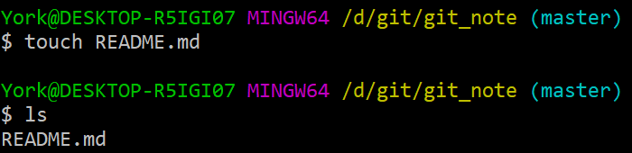
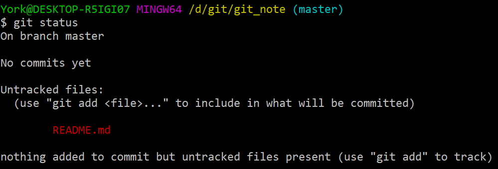
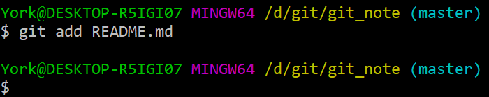
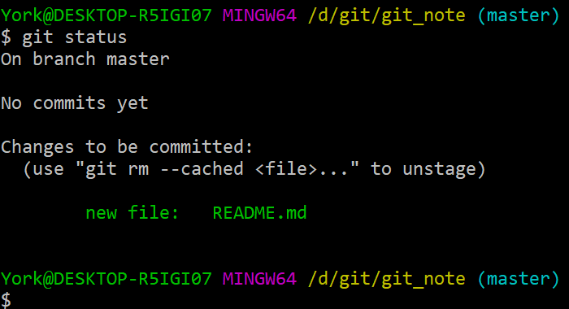
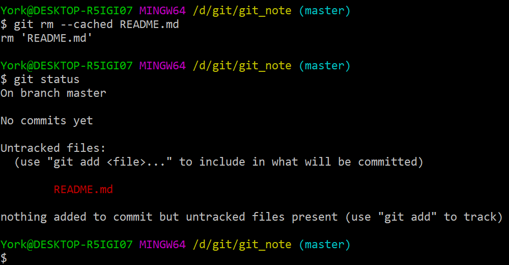
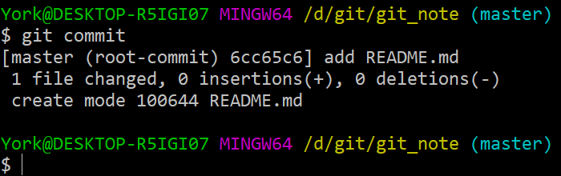

# 向本地仓库添加文件

## 1. 准备工作

### 1.1 切路径

- 方法一
    1. “右键 + `Git Bash Here`”
    2. `cd` 至目标仓库
- 方法二
    1. 进入目标文件夹
    2. “右键 + `Git Bash Here`”

### 1.2 新建文件夹

- 不妨新建一个 *README.md*

    

- 此时的 *README.md* 在<u>工作区</u>

## 2. 查看状态

- 相关命令：`git status`

    

### 说明

- 当前分支为 *master* 分支
- 目前还没进行过 `commit`
- *README.md* 未被 **“追踪”**（此时的 *README.md* 是红色的）
- *Git* 提示：建议使用 `git add <file>` 来提交内容

## 3. 将文件加入暂存区

- 相关命令：`git add <file>`

    

### 说明

- 此操作没有回馈
- 没有消息就是最好的消息

## 4. 再次查看

### 说明

- 当前分支为 *master* 分支
- 目前还没进行过 `commit`
- *README.md* 可以被 **“提交”**（此时的 *README.md* 是绿色的）
- *Git* 提示：可以说用 `git rm --cached <file>` 将刚刚 `add` 进 `stage` 的文件“踢出去”

## 5. 删除添加到暂存区的文件

- 相关命令：`git rm --cached README.md`

    

### 说明

- <u>工作区</u>的 *README.md* 还在，并且没有改变
- <u>暂存区</u>刚刚 `add` 进去的 *README.md* 被删除了

## 6. 恢复区

- 方便起见，再次使用命令 `git add <file>` ，将 *README.md* 添加到<u>暂存区</u>

## 7. 将暂存区的当前内容添加到仓库

- 相关命令：`git commit`

1. 输入命令并回车
2. 画面会发生跳转

    

3. 在箭头处加入解释说明
4. 按照 *vi* 的方法保存退出

    

5. 画面跳回

    

### 说明

- 上图第 *5* 行的数字 *100644* 是有含义的
    - *100* 指常规文件
    - *644* 指文件权限，分别对应 *r, w, x*

## 8. 第三次查看

- 此时，*README.md* 已经被加至本地仓库中了
