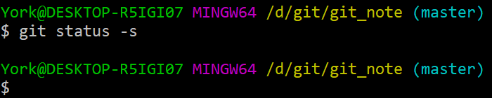
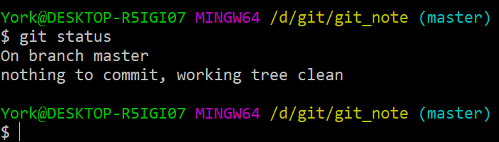
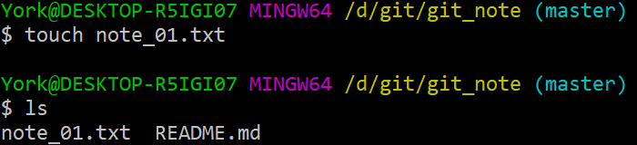
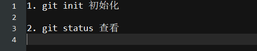
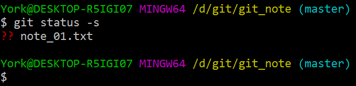
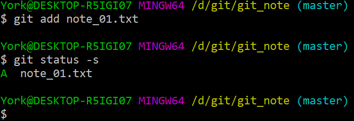
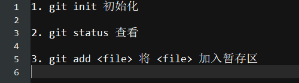
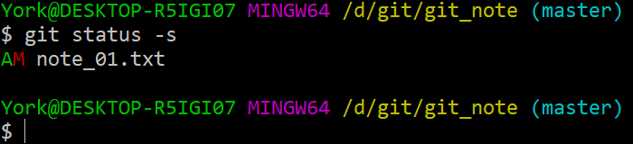

# *status*

## 1. *status* 有个参数 *-s*

- 命令：`git status -s`

    

- 说明
    - 没有消息使最好的消息
    - `git status -s` 显示的信息比 `git status` 简洁

## 2. 更多表现

### 2.1 不妨再添加一个文件

### 2.2 往 *note_01.txt* 中写入文字

### 2.3 查看

#### 说明

- 第 *3* 行开头的 ?? 说明 *note_01.txt* 还没有进行过 `add` 与 `commit`

### 2.4 将 *note_01.txt* 加入暂存区并查看

#### 说明

- 第 *5* 行开头的 A 说明 *note_01.txt* 已经被加到<u>暂存区</u>了

### 2.5 继续往 *note_01.txt* 中添加文字

## 1.8 再次查看

#### 说明

- 第 *3* 行开头
    - A 说明<u>暂存区</u>已经有一个版本的 *note_01.txt*
    - M 说明<u>工作区</u>的 *note_01.txt* 又做了修改，与<u>暂存区</u>的 *note_01.txt* 内容不一致了