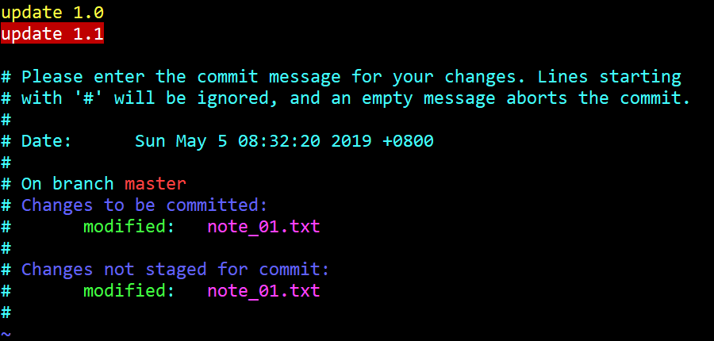

# 13. commit

## 1. 加参数 \-m

```bash
York@DESKTOP MINGW64 /d/git/git_note (master)
$ git commit -m "add note_01.txt"
[master 9884432] add note_01.txt
 1 file changed, 3 insertions(+)
 create mode 100644 note_01.txt
```

!!! note "说明"
    - 有些版本用 `git commit` 跳转并编辑后，中文部分可能会乱码
    - 使用 `git commit -m "<message>"` 可以避免乱码
    - 这里的 `commit` 作用的是暂存区的 `note_01.txt`

## 2. 更多表现

### 2.1 查看状态

```bash
York@DESKTOP MINGW64 /d/git/git_note (master)
$ git status -s
 M note_01.txt
```

!!! note "说明"
    - 末行红色的 <font color="red">M</font> 前预留了一个位置，这个位置是留给暂存区的
    - 工作区的 `note_01.txt` 有了变动，且没有将变动后的版本添加到暂存区

### 2.2 添加并提交

```bash
York@DESKTOP MINGW64 /d/git/git_note (master)
$ git commit -am "update 1.0"
[master e2e4b37] update 1.0
 1 file changed, 2 insertions(+)

York@DESKTOP MINGW64 /d/git/git_note (master)
$ git status
On branch master
nothing to commit, working tree clean
```

!!! note "说明"
    - “添加”与“提交”可以合并为一条命令
    - `-am` 的 `a` 是 `all` 的意思
    - `-am` 只对之前 `add` & `commit` 过的文件有效

### 2.3 骚操作

!!! info
    这里的“骚操作”不是操作得好，单纯就是我失误了~

!!! question "问题"
    只做了一个很小的变动，不希望增加 `commit` 操作，怎么办？

#### 方法一

- 使用命令：`git commit --amend`
- 此法可将本次提交并入上一次，并且不写“注释”，不过记录中仍有两条
- 证据：虽然 `commit` 的次数不变，但是最后一次指向的哈希值会变

##### 举例

- 在之前的基础上加入一句 `4. git commit -m "<message>" 加入仓库`

    ```
    1. git init 初始化

    2. git status 查看

    3. git add <file> 将 <file> 加入暂存区

    4. git commit -m "<message>" 加入仓库

    ```

- 我在这里犯了个错误：`commit` 之前忘记 `add` 了

    ```bash
    York@DESKTOP MINGW64 /d/git/git_note (master)
    $ git status -s
     M note_01.txt
    ```

- 不妨将错就错，看看效果
- 跳转部分

    

- 命令部分

    ```bash
    York@DESKTOP MINGW64 /d/git/git_note (master)
    $ git commit --amend
    [master 88d8db4] update 1.0 update 1.1
     Date: Sun May 5 08:32:20 2019 +0800
     1 file changed, 2 insertions(+)
    ```

#### 方法二

- 使用命令：`git commit --amend --no-edit`
- 此法可将本次提交并入上一次，并且不写“注释”，不过记录中仍有两条
- 证据：虽然 `commit` 的次数不变，但是最后一次指向的哈希值会变

##### 举例

- 同方法一，我这里犯了个错误：`commit` 之前忘记 `add` 了

    ```bash
    York@DESKTOP MINGW64 /d/git/git_note (master)
    $ git status -s
     M note_01.txt
    ```

- 不妨将错就错，看看效果

    ```bash
    York@DESKTOP MINGW64 /d/git/git_note (master)
    $ git commit --amend --no-edit
    [master 11671db] update 1.0 update 1.1
     Date: Sun May 5 08:32:20 2019 +0800
     1 file changed, 2 insertions(+)
    ```

!!! tip "补充"
    - 有参数可以使第一次 `commit` 时不写“注释”
    - 不推荐这样的操作

## 3. 骚操作的更正

### 3.1 准备工作

1. 查看当前的 `note_01.txt`

    ```
    1. git init 初始化

    2. git status 查看

    ```

2. 写入文本

    ```
    1. git init 初始化

    2. git staus 查看

    3. git add <file> 将 <file> 加入暂存区

    ```

3. 确认一下

    ```bash
    York@DESKTOP MINGW64 /d/git/git_note (master)
    $ cat note_01.txt
    1. git init 初始化

    2. git staus 查看

    3. git add <file> 将 <file> 加入暂存区
    ```

4. 提交至本地仓库，并查看状态与历史信息

    ```bash
    York@DESKTOP MINGW64 /d/git/git_note (master)
    $ git commit -am "add sentence 3"
    [master 82e9197] add sentence 3
     1 file changed, 2 insertions(+)

    York@DESKTOP MINGW64 /d/git/git_note (master)
    $ git status -s

    York@DESKTOP MINGW64 /d/git/git_note (master)
    $ git log --oneline
    82e9197 (HEAD -> master) add sentence 3
    9884432 add note_01.txt
    6cc65c6 add README.md
    ```

!!! warning "注意"
    此时的 `HEAD` 指向的版本的哈希值为 `82e9197`

### 3.2 开始操作

#### git commit \-\-amend

1. 向 `note_01.txt` 中添加文字

    ```
    1. git init 初始化

    2. git staus 查看

    3. git add <file> 将 <file> 加入暂存区

    4. git commit -m "<message>" 加入仓库

    ```

2. 加入暂存区

    ```bash
    York@DESKTOP MINGW64 /d/git/git_note (master)
    $ git status -s
     M note_01.txt

    York@DESKTOP MINGW64 /d/git/git_note (master)
    $ git add note_01.txt
    ```

3. 使用命令 `git commit --amend` 更新，写提示语
    
    

4. 使用命令 `git commit --amend` 更新，完成操作

    ```bash
    York@DESKTOP MINGW64 /d/git/git_note (master)
    $ git commit --amend
    [master 67dc44a] add sentence 3 add sentence 4
     Date: Sun May 5 12:11:57 2019 +0800
     1 file changed, 4 insertions(+)
    ```
    
3. 搞定！检验一下

    ```bash
    York@DESKTOP MINGW64 /d/git/git_note (master)
    $ git log --oneline
    67dc44a (HEAD -> master) add sentence 3 add sentence 4
    9884432 add note_01.txt
    6cc65c6 add README.md
    ```

!!! warning "注意"
    - `commit` 的次数仍然为 `3`
    - 此时的 `HEAD` 指向的版本的哈希值为 `67dc44a`，而不是之前的 `82e9197`

#### git commit \-\-amend \-\-no\-edit

1. 向 `note_01.txt` 中添加文字

    ```bash
    York@DESKTOP MINGW64 /d/git/git_note (master)
    $ echo '5. git commit -am "<>" 懒人选择' >> note_01.txt

    York@DESKTOP MINGW64 /d/git/git_note (master)
    $ git add note_01.txt
    warning: LF will be replaced by CRLF in note_01.txt.
    The file will have its original line endings in your working directory
    ```

2. `LF` 是 Linux 下的回车 `\r` 的格式，`CRLF` 是 Windows 下的换行回车 `\n\r` 的格式
3. 查看 `note_01.txt`

    ```
    1. git init 初始化

    2. git staus 查看

    3. git add <file> 将 <file> 加入暂存区

    4. git commit -m "<message>" 加入仓库
    5. git commit -am "<>" 懒人选择

    ```

4. 有些丑，我排版了一下

    ```
    1. git init 初始化

    2. git staus 查看

    3. git add <file> 将 <file> 加入暂存区

    4. git commit -m "<message>" 加入仓库

    5. git commit -am "<>" 懒人选择

    ```

5. `status`, `add`[^1], `commit`

    ```bash
    York@DESKTOP MINGW64 /d/git/git_note (master)
    $ git status -s
    MM note_01.txt

    York@DESKTOP MINGW64 /d/git/git_note (master)
    $ git add .

    York@DESKTOP MINGW64 /d/git/git_note (master)
    $ git commit --amend --no-edit
    [master 032099a] add sentence 3 add sentence 4
     Date: Sun May 5 12:11:57 2019 +0800
     1 file changed, 6 insertions(+)
    ```

6. 搞定！检验一下

    ```bash
    York@DESKTOP MINGW64 /d/git/git_note (master)
    $ git log --oneline
    032099a (HEAD -> master) add sentence 3 sentence 4
    9884432 add note_01.txt
    6cc65c6 add README.md
    ```

!!! warning "注意"
    - `commit` 的次数仍然为 `3`
    - 此时的 `HEAD` 指向的版本的哈希值为 `032099a`
    - 而不是之前的 `67dc44a` 或 `82e9197`

#### 比较

```bash
York@DESKTOP MINGW64 /d/git/git_note (master)
$ git reflog
032099a (HEAD -> master) HEAD@{0}: commit (amend): add sentence 3
67dc44a HEAD@{1}: commit (amend): add sentence 3
82e9197 HEAD@{2}: commit: add sentence 3
9884432 HEAD@{3}: reset: moving to HEAD^
11671db HEAD@{4}: reset: moving to 11671db
9884432 HEAD@{5}: reset: moving to HEAD~
11671db HEAD@{6}: reset: moving to HEAD
11671db HEAD@{7}: commit (amend): update 1.0
88d8db4 HEAD@{8}: commit (amend): update 1.0
e2e4b37 HEAD@{9}: commit: update 1.0
9884432 HEAD@{10}: commit: add note_01.txt
6cc65c6 HEAD@{11}: commit (initial): add README.md
```

!!! note "分析"
    - `3.2` 做了两次变动
    - `commit` 的次数没变，但哈希值变了两次
    - 其实每次变动都有记录

## 4. 回滚

- 毕竟添加了新的内容，不推荐“无注释”
- 用“指针”回滚的命令：`git reset --hard HEAD@{n}`

    ```bash
    York@DESKTOP MINGW64 /d/git/git_note (master)
    $ git reset --hard HEAD@{1}
    HEAD is now at 67dc44a add sentence 3 add sentence 4

    York@DESKTOP MINGW64 /d/git/git_note (master)
    $ git log --oneline
    67dc44a (HEAD -> master) add sentence 3 add sentence 4
    9884432 add note_01.txt
    6cc65c6 add README.md

    York@DESKTOP MINGW64 /d/git/git_note (master)
    $ cat note_01.txt
    1. git init 初始化

    2. git staus 查看

    3. git add <file> 将 <file> 加入暂存区

    4. git commit -m "<message>" 加入仓库
    ```

[^1]: git add \. 将工作区的所有内容都加入暂存区
