# *commit*

## 1. *commit* 有个参数 *-m*

- 命令：`git commit -m "<message>"`

    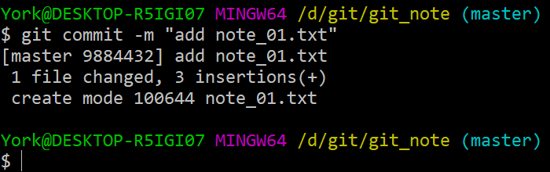

### 说明

- 有些版本用 `git commit` 跳转并编辑后，中文部分可能会乱码
- 使用 `git commit -m "<message>"` 可以避免乱码
- 这里的 *commit* 作用的是<u>暂存区</u>的 *note_01.txt*

## 2. 更多表现

### 2.1 查看

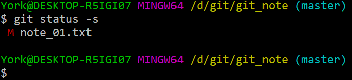

#### 说明

- 第 *3* 行的 M 前预留了一个位置，这个位置是留给<u>工作区</u>的
- <u>工作区</u>的 *note_01.txt* 有了变动，且没有将变动后的版本添加到<u>暂存区</u>

### 2.2 添加 & 提交

- “添加”与“提交”可以合并为一条命令

- 命令：`git commit -am`

    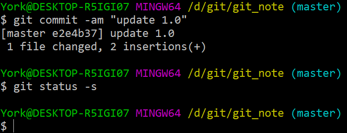

#### 说明

- `-am` 的 `a` 是 *all* 的意思
- `am` 只对之前 `add` & `commit` 过的文件有效
### 2.3 骚操作

#### 问题

- 只做了一个很小的变动，不希望增加 *commit* 操作，怎么办？

#### 2.3.1 方法一

- 使用命令：`git commit --amend`
- 此法可将本次提交并入上一次，但纪录中仍有两条
    - 证据：虽然 *commit* 的次数不变，但是哈希值会变

##### 举例

- 在之前的基础上加入一句 `4. git commit -m "\<message>" 加入仓库`

    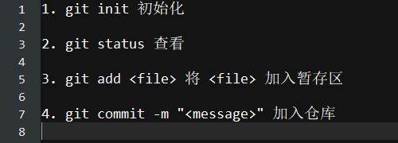

- 这里犯了个错误
    - 我 `commit` 之前忘记 `add` 了
    - 不妨将错就错，看看效果

    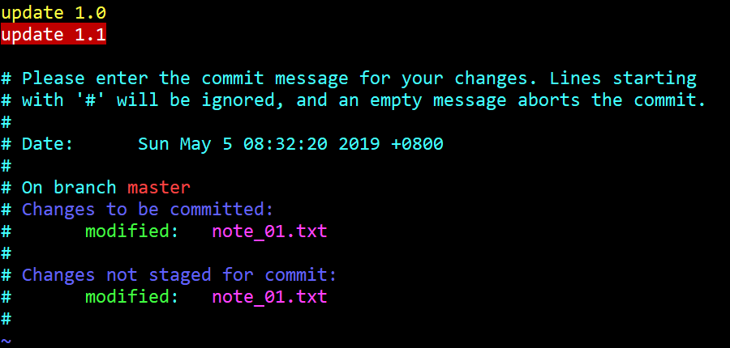

    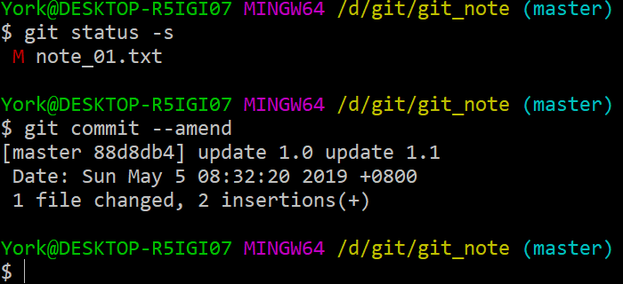

#### 2.3.2 方法二

- 方法二是方法一的进阶版
- 使用命令：`git commit --amend --no-edit`
- 此法可将本次提交并入上一次，并且不写“注释”，不过记录中仍有两条
    - 证据：虽然 *commit* 的次数不变，但是哈希值会变

##### 举例

- 同方法一，这里犯了个错误
    - 我 `commit` 之前忘记 `add` 了
    - 不妨将错就错，看看效果：M 已经说明了问题——<u>工作区</u>的文件没被追踪

    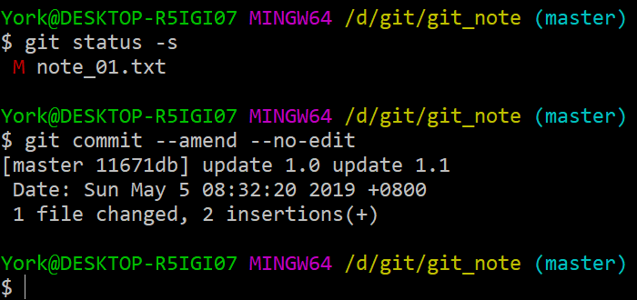

#### 补充

- 有参数可以在第一次 *commit* 时不写“注释”
- 不推荐这样的操作

## 3. 骚操作的更正

### 3.1 准备工作

1. 查看当前的 *note_01.txt*

    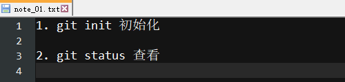

2. 写入文本

    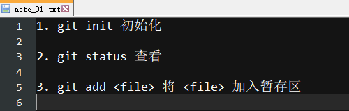

3. 确认一下

    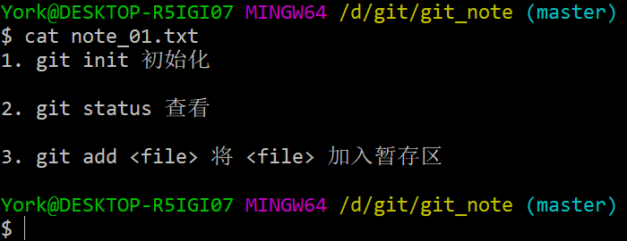

4. 提交至本地仓库，并查看状态与历史信息

    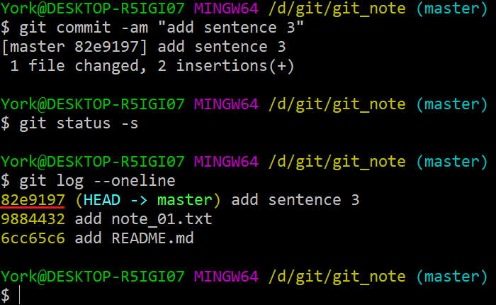

- 注意：此时的 *HEAD* 指向的版本的哈希值为 *82e9197*

### 3.2 开始操作

#### 3.2.1 *git commit --amend*

1. 向 *note_01.txt* 中添加文字

    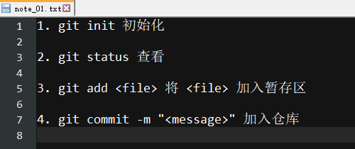

2. 使用命令 `git commit --amend` 更新
   
    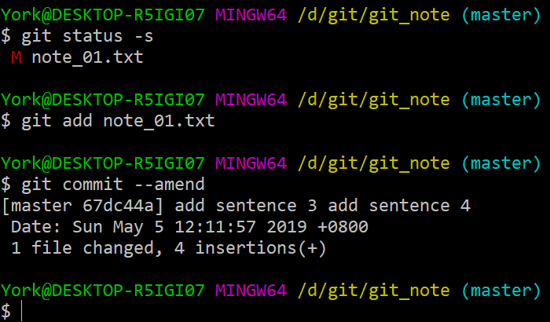
    
    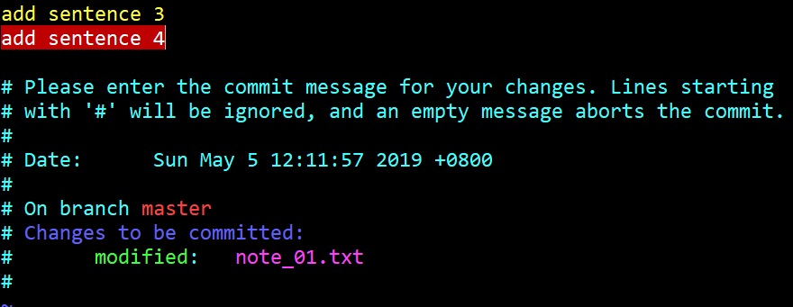
    
3. 搞定！检验一下

    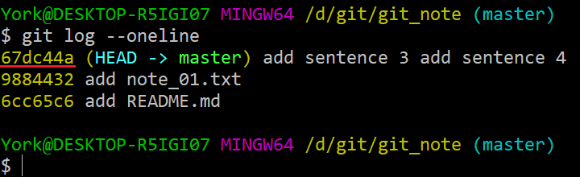

- 注意
    - *commit* 的次数仍然为 *3*
    - 此时的 *HEAD* 指向的版本的哈希值为 *67dc44a*，而不是之前的 *82e9197*

#### 3.2.2 *git commit --amend --no-edit*

1. 在 *note_01.txt* 中添加文字

    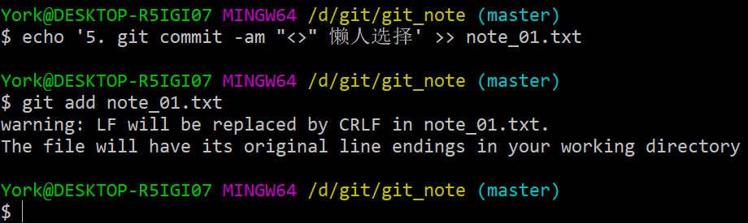

    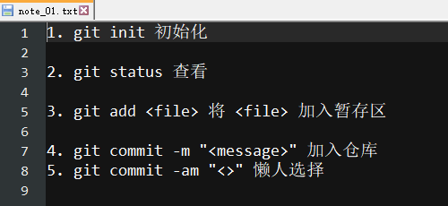

##### 说明

- *LF* 是 *Linux* 下的换行的格式
- *CRLF* 是 *Windows* 下的回车换行的格式

    | 名称 | 缩写 | ASCII 码 | 符号 |
    | :---: | :---: | :---: | :---: |
    | 换行 | **LF** | **10** | **\\r** |
    | 回车 | **CR** | **13** | **\\n** |

- 有些丑，我排版了一下

    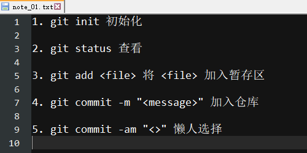

- 换行格式

    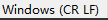

2. 查看、`add`、`commit` 一条龙

    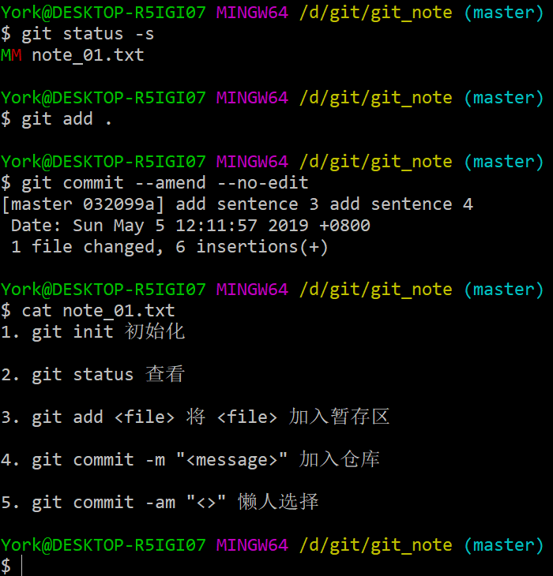

##### 说明

- 命令 `git add .` 的作用：将<u>工作区</u>的所有内容都加入<u>暂存区</u>

3. 搞定！检验一下

    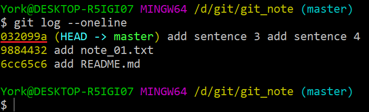

- 注意
    - *commit* 的次数仍然为 *3*
    - 此时的 *HEAD* 指向的版本的哈希值为 *032099a*，而不是之前的 *67dc44a* 或 *82e9197*

#### 3.2.3 比较

- 使用命令：`git reflog`

    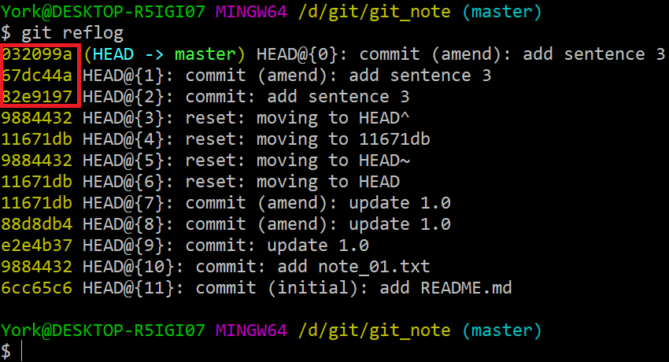

##### 分析

- `3.2.1` 与 `3.2.2` 做过两次变动，`commit` 的次数没变，但哈希值一直在变
- 其实每次变动都有记录

## 4. 回滚

- 毕竟添加了新的内容，不推荐“无注释”

- 用“指针”回滚的命令：`git reset --hard HEAD@{n}`

    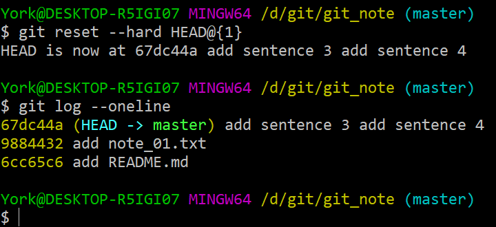

    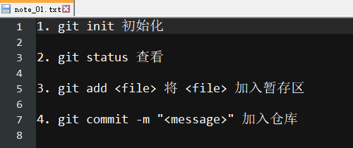