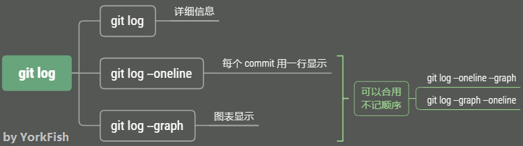

# 14. log

## 1. git log

```bash
York@DESKTOP MINGW64 /d/git/git_note (master)
$ git log
commit 11671dbe097f0238b4102403d52020b373a8a853 (HEAD -> master)
Author: York <york@email.com>
Date:   Sun May 5 08:32:20 2019 +0800

    update 1.0
    update 1.1

commit 988443224407cb64327778ef362047864986e4be
Author: York <york@email.com>
Date:   Sun May 5 08:24:22 2019 +0800

    add note_01.txt

commit 6cc65c651730a81c29a168b5ff0c6fcde684257d
Author: York <york@email.com>
Date:   Sun May 4 23:36:07 2019 +0800

    add README.md
```

## 2. git log \-\-oneline

- 毕竟是 `oneline`，显示结果比 `git log` 简洁

    ```bash
    York@DESKTOP MINGW64 /d/git/git_note (master)
    $ git log --oneline
    11671db (HEAD ->master) update 1.0 update 1.1
    9884432 add note_01.txt
    6cc65c6 add README.md
    ```

### 命令补充

- 命令：`git log --oneline --graph`
- 举例：详见 <a href="https://yorkfish.github.io/blogs/git/gitbash/23-conflict-resolution/" target="_blank">23 解决冲突</a> 的第 `4` 步

## 3. git reflog

- 此命令会显示更详尽的版本信息

    ```bash
    York@DESKTOP MINGW64 /d/git/git_note (master)
    $ git reflog
    11671db (HEAD -> master) HEAD@{0}: commit (amend): update 1.0
    88d8db4 HEAD@{1}: commit (amend): update 1.0
    e2e4b37 HEAD@{2}: commit: update 1.0
    9884432 HEAD@{3}: commit: add note_01.txt
    6cc65c6 HEAD@{4}: commit: (initial): add README.md
    ```

## 4. 小结



## 5. 补充

### git \-\-pretty=oneline

- `--pretty` 是“关键字参数”
- `oneline` 只是 `--pretty` 的一种格式
- 此外还有 `short`, `full`, `fuller`, `format`, `raw` 等参数
- 用法：如 `git --pretty=short`

### git log \-\-graph \-\-oneline \-\-decorate \-\-all

- `--decorate` —— 用来显示 `HEAD`、分支名、标签名等信息
- `--all` —— 简单地说，就是显示更全的信息，它会把过往的 `commit` 信息都列出来
- 举例：详见 <a href="https://yorkfish.github.io/blogs/git/gitbash/29-rebase/" target="_blank">29 rebase</a> 的 `2`

### 更多的参数

| 参数 | 释义 |
| :--- | :--- |
| `--abbrev-commit`             | 简化 `commit` 的哈希值信息（提交次数较少时，效果不明显） |
| `--author=sb.`                | 显示 `sb.` 的信息 |
| `--before={}`<br>`--after={}` | 可以定查看的时间区间<br>`{}` 中的格式可以是 `2.weeks.ago` 或 `2020-01-01` |
| `-n`                          | 显示 n 条信息 |
| `--no-merges`                 | 隐藏“合并提交” |
| `-p`                          | 显示更详细的信息 |
| `--reverse`                   | 逆向显示 |
| `--skip=n`                    | 跳过前 n 条信息 |

!!! tip
    <a href="https://git-scm.com/doc" target="_blank">官方文档</a>非常详细，有别的需求，可以去搜索
