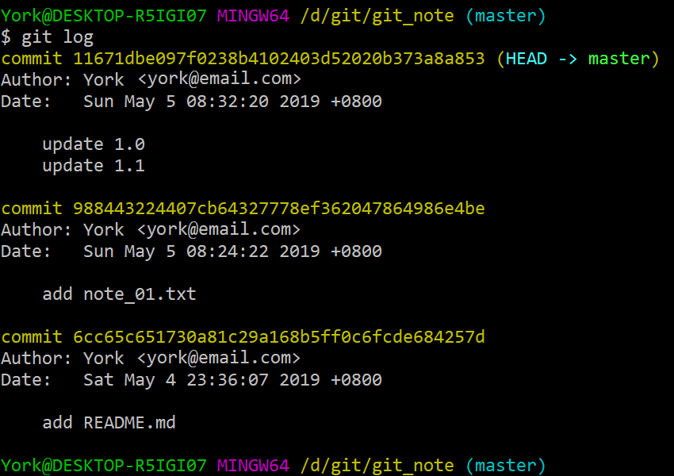
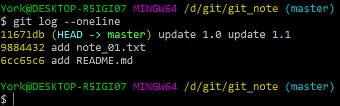
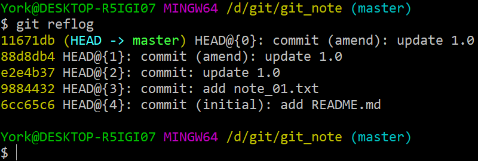

# *log*

## 1. *git log*

## 2. *git log --oneline*

- 此命令的显示结果比 `git log` 简洁
- 毕竟是 *oneline*

    

### 命令补充

- 命令：`git log --oneline --graph`

- 举例：详见 <a href="" target="_blank">23_解决冲突</a> 的第 *4* 步

## 3. *git reflog*

- 此命令会显示更详尽的版本信息

    

## 4. 小结

## 5. 补充

### 5.1 *git \-\-pretty=--oneline*

- `--pretty` 是“关键字参数”
-  `--oneline` 只是 `--pretty` 的一种格式
- 此外还有 `short`, `full`, `fuller`, `format`, `raw` 等参数
- 用法：如 `git --pretty=short`

### 5.2 *git log \-\-graph \-\-oneline \-\-decorate \-\-all*

- `--decorate` —— 用来显示 `HEAD`、分支名、标签名等信息
- `--all` —— 简单地说，就是显示更全的信息，它会把过往的 `commit` 信息都列出来
- 举例：详见 <a href="" target="_blank">29_rebase</a> 的 *2*

### 5.3 更多的参数

| 参数 | 释义 |
| :---: | :--- |
| `--abbrev-commit` | 简化 "commit" 的哈希值信息（提交次数较少时，效果不明显） |
| `--author=sb.` | 显示 sb. 的信息 |
| `--before={}` `--after={}` | 可以定查看的时间区间 {} 中的格式可以是 `2.weeks.ago` 或 ` 2020-01-01` |
| `-n` | 显示 n 条信息 |
| `--no-merges` | 隐藏“合并提交” |
| `-p` | 显示更详细的信息 |
| `--reverse` | 逆向显示 |
| `--skip=n` | 跳过前 n 条信息 |

- 官方文档非常详细，有别的需求，可以去搜索