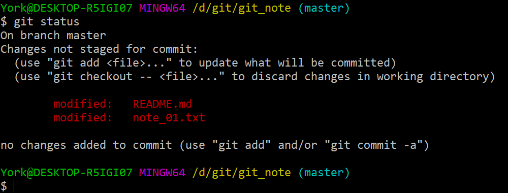
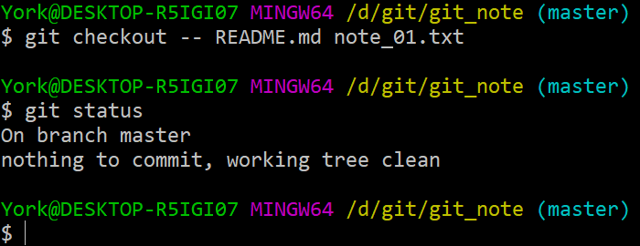
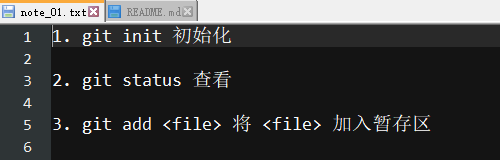
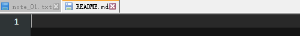
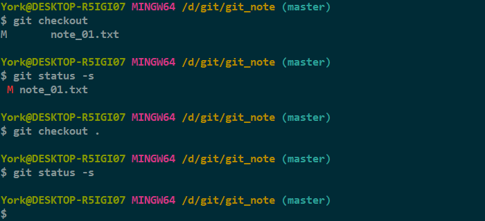

# *checkout file*

## 1. 当前状态

### 说明

- 当前处于 *master* 分支
- <u>暂存区</u>上一个版本的文件均已提交至<u>仓库</u>
- 此时<u>暂存区</u>的内容与<u>仓库</u>指向的版本的内容一致
- 似曾相识的 modified
    - `git status -s` 回馈的 m 就是指 modified
    - 这里表明<u>工作区</u>的 *README.md* 与 *note_01.txt* 发生了变动
- 提示中最后一行表明 `git add` 与 `git commit -a` 有相同的效果

### 补充

- *Git* 中常见的三种状态
  
    | 状态名 | 释义 |
    | :---: | :--- |
    | modified | 已修改 |
    | staged | 已暂存 |
    | committed | 已提交 |

## 2. *git checkout \-\- <file\>*

- 命令的作用

    - 舍弃<u>工作区</u>的更改
    - 即，将<u>工作区</u>的内容拉回到<u>暂存区</u>的版本
    - 即，用<u>暂存区</u>的内容覆盖<u>工作区</u>
- 虽说这条命令要少用，做实验嘛，不妨用一下
- `<file>` 可以是多个文件，用空格隔开即可

### 2.1 示意图

### 2.2 覆盖操作

### 2.3 查看

#### 说明

- *note_01.txt* 少了一句 `4. git commit -m "<message>" 加入仓库`
    - 这句话并不是消失了，而是当初就没存在过
    - 之前的博文 `13_commit` 的 `2.3 骚操作` 中光顾着 `commit`，而在 `commit` 之前忘了 `add`
- *README.md*
    - <u>暂存区</u>里的 *README.md* 本来就没写东西，所以是空白的
    - `2.1` 的 modified 是因为我当时变动了<u>工作区</u>的 *README.md*

## 3. *git checkout .*

- 命令的作用：将<u>暂存区</u>中的内容尽数回滚给<u>工作区</u>
- **此命令有危险！慎用！**

### 3.1 操作

1. 对 *note_01.txt* 做些改动
2. 查看状态

    

3. 使用 `git checkout .`

    

### 3.2 分析

- 仅仅使用 `git checkout`
    - 没有效果
    - 有一个反馈：*note_n1.txt* 处于“未追踪”状态
- 只有使用 `git checkout .` 才生效