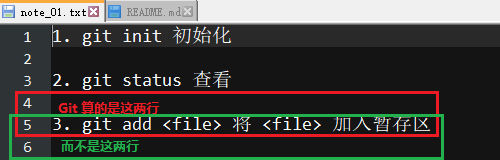
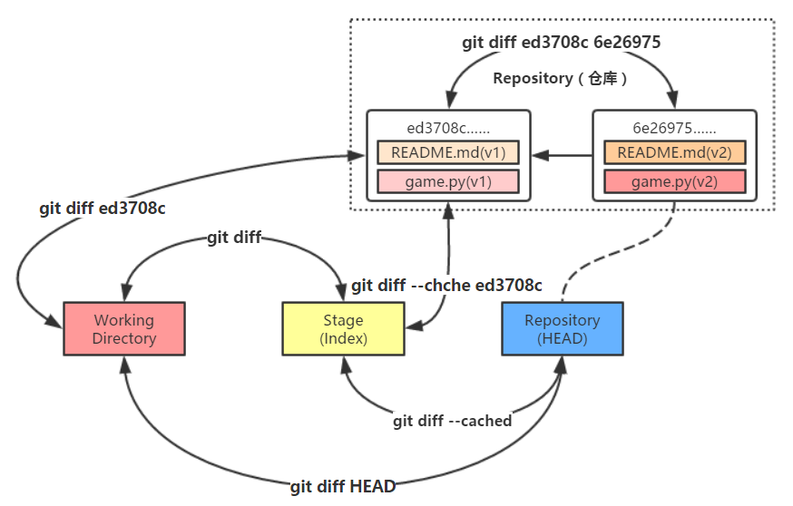

# 16. diff

## 1. git diff <file\>

- 命令作用：可以比较 `file` 在工作区与暂存区的异同

    ```bash
    York@DESKTOP MINGW64 /d/git/git_note (master)
    $ git diff README.md

    York@DESKTOP MINGW64 /d/git/git_note (master)
    $ git diff note_01.txt
    ```

### 分析

- 因为上一步的操作是“用暂存区的文件覆盖工作区的文件”，所以此时两者一样，继而没有反馈

## 2. git diff \-\-cached <file\>

- 命令作用：可以比较 `file` 在暂存区与仓库的异同

    ```bash
    York@DESKTOP MINGW64 /d/git/git_note (master)
    $ git diff --cached note_01.txt
    ```

### 分析

- 目前，工作区，暂存区和仓库这“三棵树”的内容是一样的，故，`diff` 找不出 `note_01.txt` 的不同之处

## 3. git diff HEAD <file\>

- 命令作用：可以比较 `file` 在工作区与仓库的异同

    ```bash
    York@DESKTOP MINGW64 /d/git/git_note (master)
    $ git diff HEAD note_01.txt
    ```

### 分析

- 目前，工作区，暂存区和仓库这“三棵树”的内容是一样的，故，`diff` 找不出 `note_01.txt` 的不同之处

## 4. git diff <hash\_id\> <file\>

- `git reflog` 所列出的哈希值与 `HEAD@{n}` 均有妙用

    ```bash
    York@DESKTOP MINGW64 /d/git/git_note (master)
    $ git reflog
    11671db (HEAD -> master) HEAD@{0}: commit (amend): update 1.0
    88d8db4 HEAD@{1}: commit (amend) update 1.0
    e2e4b37 HEAD@{2}: commit: update 1.0
    9884432 HEAD@{3}: commit: add note_01.txt
    6cc65c6 HEAD@{4}: commit: (initial): add README.md
    ...
    ```

- 用 `hash_id` 代替 `git diff HEAD <file>` 中的 `HEAD`，用于比较 `file` 在工作区与仓库的历史版本的异同
- 如，我要与 `HEAD@{3}` 比较

    ```bash
    York@DESKTOP MINGW64 /d/git/git_note (master)
    $ git diff 9884432 note_01.txt
    diff --git a/note_01.txt b/note_01.txt
    index ea35394..2914bae 100644
    --- a/note_01.txt
    +++ b/note_01.txt
    @@ -1,3 +1,5 @@
     1. git init 初始化
     2. git status 查看
    +
    +3. git add <file> 将 <file> 加入暂存区
    ```

### 分析

- 此命令比较的是：工作区的 `note_01.txt` 和仓库中版本号为 `9884432` 的 `note_01.txt`
- 在 `2. git status 查看` 的下方多了两行

    

## 5. git diff \-\-cached <hash\_id\> <file\>

- 有了哈希值做 `id`，可以比较的东西就多了
- 命令作用：可以比较 `file` 在暂存区与仓库的历史版本的异同

    ```bash
    York@DESKTOP MINGW64 /d/git/git_note (master)
    $ git diff --cached 9884432 note_01.txt
    diff --git a/note_01.txt b/note_01.txt
    index ea35394..2914bae 100644
    --- a/note_01.txt
    +++ b/note_01.txt
    @@ -1,3 +1,5 @@
     1. git init 初始化

     2. git status 查看
    +
    +3. git add <file> 将 <file> 加入暂存区
    ```

## 6. git diff <hash\_id1\> <hash\_id2\> <file\>

- 命令作用：可以比较 `file` 在仓库的历史版本2与仓库的历史版本1之间的异同

```bash
York@DESKTOP MINGW64 /d/git/git_note (master)
$ git diff 11671db 9884432 note_01.txt
diff --git a/note_01.txt b/note_01.txt
index 2914bae..ea35394 100644
--- a/note_01.txt
+++ b/note_01.txt
@@ -1,5 +1,3 @@
 1. git init 初始化

 2. git status 查看
-
-3. git add <file> 将 <file> 加入暂存区
```

### 分析

- 以 <font color="green">+</font> 开头，说明增加了 xxx
- 以 <font color="red">-</font> 开头，说明减少了 xxx
- 上面的例子是以 `<hash_id2>` 为“对照组”，以 `<hash_id1>` 为“实验组”，即
    - `<hash_id2>` 是比较的基准
    - 结果显示 `<hash_id2>` 比 `<hash_id1>` 多了/少了 xxx
- 证据：`<hash_id1>` 与 `<hash_id2>` 换一下顺序，结果会变

    ```bash
    York@DESKTOP MINGW64 /d/git/git_note (master)
    $ git diff 9884432 11671db note_01.txt
    diff --git a/note_01.txt b/note_01.txt
    index ea35394..2914bae 100644
    --- a/note_01.txt
    +++ b/note_01.txt
    @@ -1,3 +1,5 @@
     1. git init 初始化

     2. git status 查看
    +
    +3. git add <file> 将 <file> 加入暂存区
    ```

### 补充

- 可以使用 `git reflog` 出来的 `HEAD@{n}` 代替 `hash_id`
- 具体例子见博文：《13-commit》 的 `4. 回滚`

## 7. 小结

- 在网上寻得一张关于 `diff` 的图片，我就不重复造轮子了

    

- 图片出处：<a href="https://fishc.com.cn/thread-71718-1-1.html" target="_blank">https://fishc.com.cn/thread-71718-1-1.html</a>
