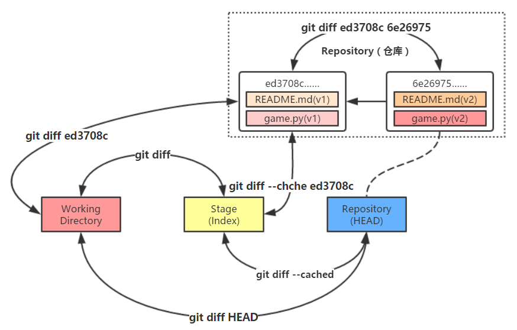

# *diff*

## 1. *git diff <file\>*

- 命令作用：可以比较 ***file*** 在<u>工作区</u>与<u>暂存区</u>的异同

    

### 分析

- 因为上一步的操作是“用<u>暂存区</u>的文件覆盖<u>工作区</u>的文件”，所以此时两者一样，继而没有反馈

## 2. *git diff \-\-cached <file\>*

- 命令作用：可以比较 ***file*** 在<u>暂存区</u>与<u>仓库</u>的异同

    

### 分析

- 目前，<u>工作区</u>，<u>暂存区</u>和<u>仓库</u>这“三棵树”的内容是一样的，故，`diff` 找不出 *note_01.txt* 的不同之处

## 3. *git diff HEAD <file\>*

- 命令作用：可以比较 ***file*** 在<u>工作区</u>与<u>仓库</u>的异同

    

### 分析

- 目前，<u>工作区</u>，<u>暂存区</u>和<u>仓库</u>这“三棵树”的内容是一样的，故，`diff` 找不出 *note_01.txt* 的不同之处

## 4. *git diff <hash_id\> <file\>*

- `git reflog` 所列出的哈希值与 `HEAD@{n}` 均有妙用

    

- 用 `hash_id` 代替 `git diff HEAD <file>` 中的 `HEAD`，用于比较 ***file*** 在<u>工作区</u>与<u>仓库的历史版本</u>的异同

- 如，我要与 `HEAD@{3}` 比较

    

### 分析

- 此命令比较的是：<u>工作区</u>的 *note_01.txt* 和<u>仓库中版本号为 *9884432*</u> 的 *note_01.txt*
- 在 `2. git status 查看` 的下方多了两行

    

## 5. *git diff --cached <hash_id\> <file\>*

- 有了哈希值做 *id*，可以比较的东西就多了

- 命令作用：可以比较 ***file*** 在<u>暂存区</u>与<u>仓库的历史版本</u>的异同

    

## 6. *git diff <hash_id1\> <hash_id2\> <file\>*

- 命令作用：可以比较 ***file*** 在<u>仓库的历史版本2</u>与<u>仓库的历史版本1</u>之间的异同

### 分析

- 以 + 开头，说明增加了 xxx
- 以 - 开头，说明减少了 xxx
- 上面的例子是以 `<hash_id2>` 为“对照组”，以 `<hash_id1>` 为“实验组”，即
    - `<hash_id2>` 是比较的基准
    - 结果显示 `<hash_id2>` 比 `<hash_id1>` 多了/少了 xxx
- 证据：`<hash_id1>` 与 `<hash_id2>` 换一下顺序，结果会变

    

### 补充

- 可以使用 `git reflog` 出来的 `HEAD@{n}` 代替 `hash_id`
- 具体例子见博文：`13_commit` 的 `4. 回滚`

## 7. 小结

- 在网上寻得一张关于 *diff* 的图片，我就不重复造轮子了

    

- 图片出处：<a href="https://fishc.com.cn/thread-71718-1-1.html" target="_blank">https://fishc.com.cn/thread-71718-1-1.html</a>