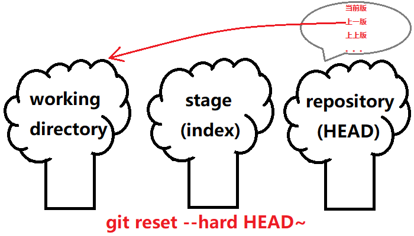

# 17. 逆转未来

## 1. git reset \-\-hard HEAD\~

- 命令作用：回滚到上一个版本

### 1.1 示意图



### 1.2 操作

```bash
York@DESKTOP MINGW64 /d/git/git_note (master)
$ git log --oneline
11671db (HEAD -> master) update 1.0 update 1.1
9884432 add note_01.txt
6cc65c6 add README.md

York@DESKTOP MINGW64 /d/git/git_note (master)
$ git reset --hard HEAD~

York@DESKTOP MINGW64 /d/git/git_note (master)
$ git log --oneline
9884432 (HEAD -> master) add note_01.txt
6cc65c6 add README.md
```

## 2. git reset \-\-hard <hash\_id\>

- 命令作用：回滚到 `hash_id` 对应的版本

    ```bash
    York@DESKTOP MINGW64 /d/git/git_note (master)
    $ git reset --hard 11671db
    HEAD is now at 11671db update 1.0 update 1.1

    York@DESKTOP MINGW64 /d/git/git_note (master)
    $ git log --oneline
    11671 (HEAD -> master) update 1.0 update 1.1
    9884432 add note_01.txt
    6cc65c6 add README.md
    ```

!!! note "说明"
    - `hash_id` 可以不写全
    - 上图的 `hash_id` 已经是缩写了，而且还可以再缩
    - 前提：缩写后的值得是 **“唯一”** 的
    - 若忘了 `hash_id`，可以使用 `git reflog` 找回

## 3. git reset \-\-hard HEAD^

- 大多数的情况下，与 `git reset --hard HEAD~` 等效

    ```bash
    York@DESKTOP MINGW64 /d/git/git_note (master)
    $ git reset --hard HEAD^
    HEAD is now at 9884432 add note_01.txt

    York@DESKTOP MINGW64 /d/git/git_note (master)
    $ git log --oneline
    9884432 (HEAD -> master) add note_01.txt
    ```

!!! note "说明"
    有些版本的 `^` 需要加引号，如 `git reset --hard HEAD"^"`

## 4. 几个注意点

1. “时间管理局”有“穿越记录”

    ```bash
    York@DESKTOP MINGW64 /d/git/git_note (master)
    $ git reflog
    9884432 (HEAD -> master) HEAD@{0}: reset: moving to HEAD^
    11671db HEAD@{1}: reset: moving to 11671db
    9884432 (HEAD -> master) HEAD@{2}: reset: moving to HEAD~
    11671db HEAD@{3}: reset: moving to HEAD
    11671db HEAD@{4}: commit (amend): update 1.0
    88d8db4 HEAD@{5}: commit (amend): update 1.0
    e2e4b37 HEAD@{6}: commit: update 1.0
    9884432 (HEAD -> master) HEAD@{7}: commit add note_01.txt
    6cc65c6 HEAD@{8}: commit (initial): add README.md
    ```

2. `~` 或 `^` 可以累加，如果有许多记录
    - 可以用 `git reset --hard HEAD~~` 回到上上个版本，并依次类推
    - 可以用 `git reset --hard HEAD~10` 依次往前回滚 `10` 下
3. `命令 git reset --hard HEAD` 虽没效果，但仍然要算一次记录
4. 保险起见，先 `git reflog`，再 `git reset --hard <hash_id>`
5. 不喜欢 `hash_id` 的话，可以用“指针”，即 `HEAD@{n}`

## 5. 小结脑图


## 6. 关于单个文件的回滚

### 6.1 操作

- 命令：`git reset HEAD~ <file>`
- 作用：将仓库中上个版本的 `<file>` 拉倒暂存区

```bash
York@DESKTOP MINGW64 /d/git/git_note (master)
$ git status -s

York@DESKTOP MINGW64 /d/git/git_note (master)
$ git log --oneline
67dc44a (HEAD -> master) add sentence 3 add sentence 4
9884432 add note_01.txt
6cc65c6 add README.md

York@DESKTOP MINGW64 /d/git/git_note (master)
$ git reset HEAD~ note_01.txt
Unstaged changes after reset:
M       note_01.txt

York@DESKTOP MINGW64 /d/git/git_note (master)
$ git diff note_01.txt
diff --git a/note_01.txt b/note_01.txt
index ea35394..5aecd94 100644
--- a/note_01.txt
+++ b/note_01.txt
@@ -1,3 +1,7 @@
 1. git init 初始化

 2. git status 查看
+
+3. git add <file> 将 <file> 加入暂存区
+
+4. git commit -m "<message>" 加入仓库

York@DESKTOP MINGW64 /d/git/git_note (master)
$ git reset HEAD note_01.txt
```

### 6.2 恢复

- 借助仓库中当前版本的 `<file>` 恢复

```bash
York@DESKTOP MINGW64 /d/git/git_note (master)
$ git status -s
MM note_01.txt

York@DESKTOP MINGW64 /d/git/git_note (master)
$ git reset HEAD note_01.txt

York@DESKTOP MINGW64 /d/git/git_note (master)
$ git status
On branch master
nothing to commit, working tree clean
```

## 7. 关于 \-\-hard

- 既然有 `hard`，那么应该也有 `soft`
- 此外，还有一个 `mixed`

| 参数 | 释义 |
| :--- | :--- |
| `--hard`  | 移动 `HEAD`，使指向的“快照”用于工作区与暂存区 |
| `--soft`  | 移动 `HEAD` 的指向，但不回滚 |
| `--mixed` | 仅对暂存区做回滚 |

***

## 补充：restore

- `git restore [--worktree] <file>` 将暂存区的 `<file>` 恢复给工作区
- `git restore --staged <file>` 将仓库的 `<file>` 恢复给暂存区
- `git restore --staged --worktree <file>` 将仓库的 `<file>` 恢复给暂存区和工作区
- `git restore --source <branch> <file>` 指定仓库的版本与分支，将对应的 `<file>` 恢复给工作区
