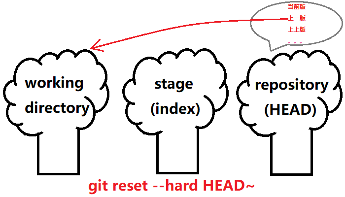
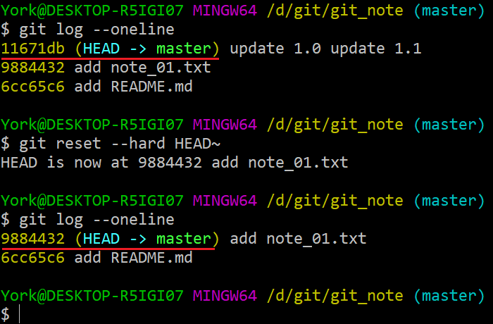
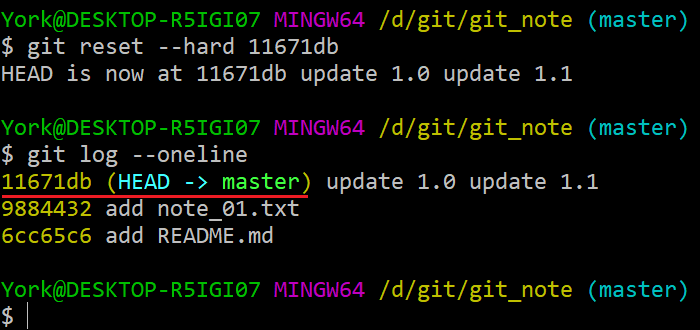
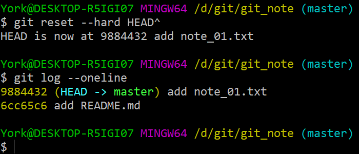
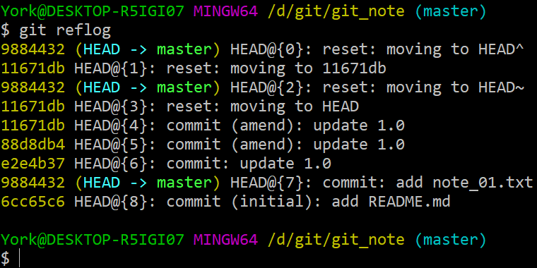
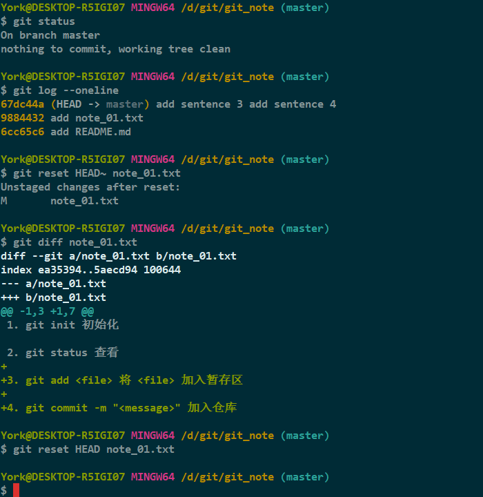
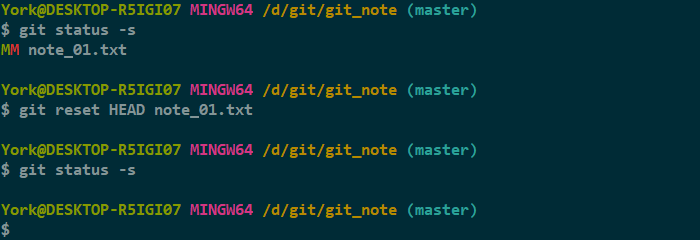

# 逆转未来

## 1. *git reset --hard HEAD~*

- 命令作用：回滚到上一个版本

### 1.1 示意图

### 1.2 操作

## 2. *git reset \-\-hard <hash_id\>*

- 命令作用：回滚到 `hash_id` 对应的版本

    

### 说明

- `hash_id` 可以不写全
- 上图的 `hash_id` 已经是缩写了，而且还可以再缩
- 前提：缩写后的值得是 **“唯一”** 的
- 若忘了 `hash_id`，可以使用 `git reflog` 找回

## 3. *git reset \-\-hard HEAD^*

- 大多数的情况下，与 `git reset --hard HEAD~` 等效

    

### 说明

- 有些版本的 `^` 需要加引号，如 `git reset --hard HEAD"^"`

## 4. 几个注意点

1. “时间管理局”有“穿越记录”

    

2. `~` 或 `^` 可以累加，如果有许多记录
   
    - 可以用 `git reset --hard HEAD~~` 回到上上个版本，并以此类推
    - 可以用 `git reset --hard HEAD~10` 依次往前回滚 *10* 下
3. `命令 git reset --hard HEAD` 虽没效果，但仍然要算一次记录
4. 保险起见，先 `git reflog`，再 `git reset --hard <hash_id>`
5. 不喜欢 `hash_id` 的话，可以用“指针”，即 `HEAD@{n}`

## 5. 小结脑图

## 6. 关于单个文件的回滚

### 6.1 操作

- 命令：`git reset HEAD~ <file>`
- 作用：将<u>仓库</u>中上个版本的 *\<file\>* 拉倒<u>暂存区</u>

### 6.2 恢复

- 借助<u>仓库</u>中当前版本的 *\<file\>* 恢复

## 7. 关于 *\-\-hard*

- 既然有 *hard*，那么应该也有 *soft*
- 此外，还有一个 *mixed*

| 参数 | 释义 |
| :---: | :--- |
| `--hard` | 移动 *HEAD*，使指向的“快照”用于<u>工作区</u>与<u>暂存区</u> |
| `--soft` | 移动 *HEAD* 的指向，但不回滚 |
| `--mixed` | 仅对<u>暂存区</u>做回滚 |
