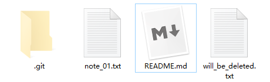

# 18. rm

## 1. git rm \-\-cached <file\>

- 命令作用：仅删除暂存区的文件 `<file>`

## 2. git rm <file\>

### 2.1 rm <file\>

1. 新建一个文件并添加至仓库

    ```bash
    York@DESKTOP MINGW64 /d/git/git_note (master)
    $ git status -s

    York@DESKTOP MINGW64 /d/git/git_note (master)
    $ ls
    README.md  note_01.txt

    York@DESKTOP MINGW64 /d/git/git_note (master)
    $ touch will_be_deleted.txt

    York@DESKTOP MINGW64 /d/git/git_note (master)
    $ git add will_be_deleted.txt

    York@DESKTOP MINGW64 /d/git/git_note (master)
    $ git commit -m "add will_be_deleted.txt"
    [master 3f06ce7] add will_be_deleted.txt
     1 file changed, 0 insertions(+), 0 deletions(-)
     create mode 100644 will_be_deleted.txt
    ```

2. 利用 `rm <file>` 命令删除工作区的文档 `will_be_deleted.txt`

    ```bash
    York@DESKTOP MINGW64 /d/git/git_note (master)
    $ git status -s
     D will_be_deleted.txt
    ```

!!! note "分析"
    - `rm <file>` 仅删除工作区的文件，对暂存区无效
    - <font color="red">D</font> 对应 deleted

### 2.2 右键 > 删除

#### 2.2.1 准备工作

- 先把工作区的 `will_be_deleted.txt` 恢复回来

```bash
York@DESKTOP MINGW64 /d/git/git_note (master)
$ git checkout -- will_be_deleted.txt

York@DESKTOP MINGW64 /d/git/git_note (master)
$ ls
README.md  note_01.txt  will_be_deleted.txt

York@DESKTOP MINGW64 /d/git/git_note (master)
$ git status
On branch master
nothing to commit, working tree clean
```

#### 2.2.2 操作

1. 在图形界面（文件管理器）中删除
2. 删前

    

3. 删后

    

4. 查看

    ```bash
    York@DESKTOP MINGW64 /d/git/git_note (master)
    $ git status -s
     D will_be_deleted.txt
    ```

!!! note "分析"
    - `2.1` 是终端命令，`2.2` 是图形界面，都只对工作区有效
    - 其实这一茬没必要提，但小心一点总是没错的

### 2.3 git rm <file\>

- 命令作用：删除暂存区的文件 `<file>`

#### 2.3.1 准备工作

- 先把工作区的 `will_be_deleted.txt` 恢复回来

#### 2.3.2 操作

- 使用命令 `git rm <file>` 同时删除工作区与暂存区的文件 `will_be_deleted.txt`

    ```bash
    York@DESKTOP MINGW64 /d/git/git_note (master)
    $ git rm will_be_deleted.txt
    rm 'will_be_deleted.txt'

    York@DESKTOP MINGW64 /d/git/git_note (master)
    $ git status -s
    D  will_be_deleted.txt
    ```

!!! note "分析"
    - `git rm <file>` 有两种理解方式
        1. 相当于：同时删除是工作区与暂存区的 `<file>`
        2. 相当于：先删除工作区的 `<file>`，再使用 `git add .`

#### 补充

- 删除文件夹，使用：`git rm -r <folder>`

## 3. git rm <file\> 的恢复

- 方法不唯一，如
- 先从仓库将文件 `<file>` 恢复到暂存区
- 再从暂存区将文件 `<file>` 恢复到工作区

```bash
York@DESKTOP MINGW64 /d/git/git_note (master)
$ git reset HEAD will_be_deleted.txt
Unstaged changed after reset:
D       will_be_deleted.txt

York@DESKTOP MINGW64 /d/git/git_note (master)
$ git checkout -- will_be_deleted.txt

York@DESKTOP MINGW64 /d/git/git_note (master)
$ ls
README.md  note_01.txt  will_be_deleted.txt

York@DESKTOP MINGW64 /d/git/git_note (master)
$ git status
On branch master
nothing to commit, working tree clean
```
