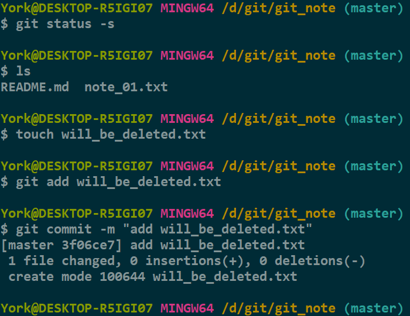
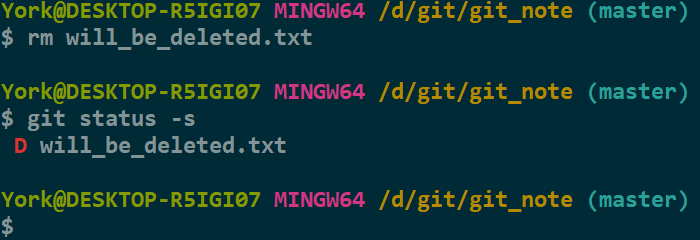
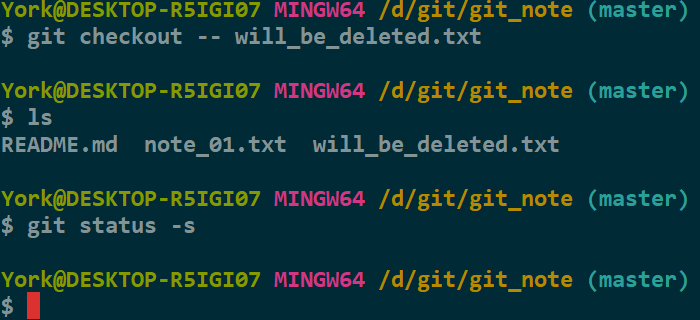
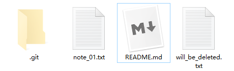
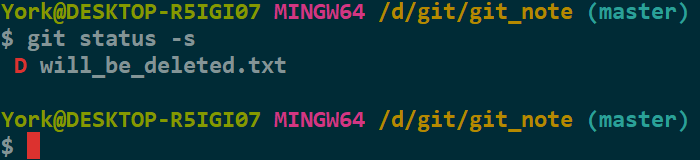
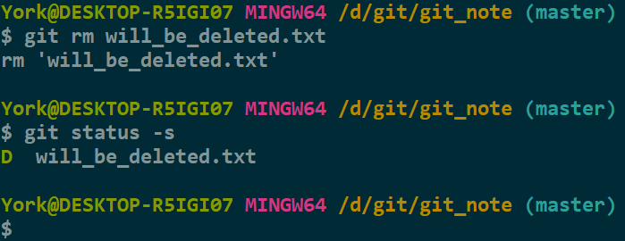
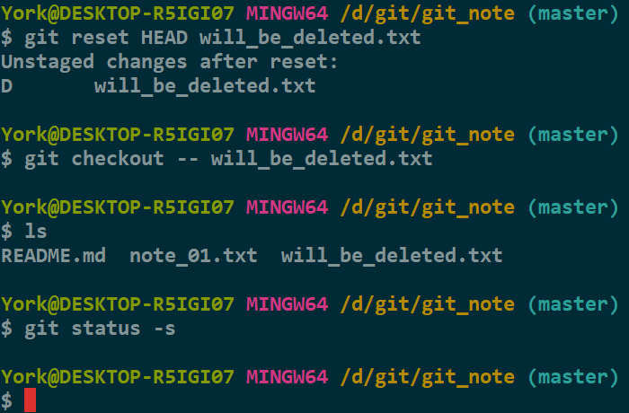

# *rm*

## 1. *git rm \-\-cached <file\>*

- <a href="" target="_blank">09_在本地建一个仓库</a> 的 `5. 删除添加到暂存区的文件` 有提及
- 命令作用：仅删除<u>暂存区</u>的文件 *\<file\>*

## 2. *git rm <file\>*

### 2.1 *rm <file\>*

1. 新建一个文件并添加至<u>仓库</u>

    

2. 利用 `rm <file>` 命令删除<u>工作区</u>的文档 *will_be_deleted.txt*

    

#### 分析

- `rm <file>` 仅删除<u>工作区</u>的文件，对<u>暂存区</u>无效
- *D for deleted*

### 2.2 右键 -> 删除

#### 2.2.1 准备工作

- 先把<u>工作区</u>的 *will_be_deleted.txt* 恢复回来

#### 2.2.2 操作

1. 在图形界面（文件管理器）中删除

    - 删前

    

    - 删后

    

2. 查看

    

#### 分析

- 与 `2.1` 一样，文件管理器仅删除<u>工作区</u>的文件，对<u>暂存区</u>无效
- 其实这一茬没必要提，但小心一点总是没错的

### 2.3 *git rm <file\>*

- 命令作用：删除<u>暂存区</u>的文件 *\<file\>*

#### 2.3.1 准备工作

- 先把<u>工作区</u>的 *will_be_deleted.txt* 恢复回来

#### 2.3.2 操作

- 使用命令 `git rm <file>` 同时删除<u>工作区</u>与<u>暂存区</u>的文件 *will_be_deleted.txt*

    

#### 分析

- `git rm <file>` 有两种理解方式
    1. 相当于：同时删除是<u>工作区</u>与<u>暂存区</u>的 *\<file\>*
    2. 相当于：先删除<u>工作区</u>的 *\<file\>*，再使用 `git add .`

## 3. *git rm <file\>* 的恢复

- 方法不唯一，如
    1. 从<u>仓库</u>将文件 *\<file\>* 恢复到<u>暂存区</u>
    2. 从<u>暂存区</u>将文件 *\<file\>*恢复到<u>工作区</u>

    
