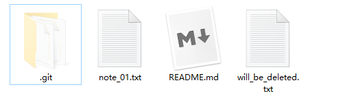
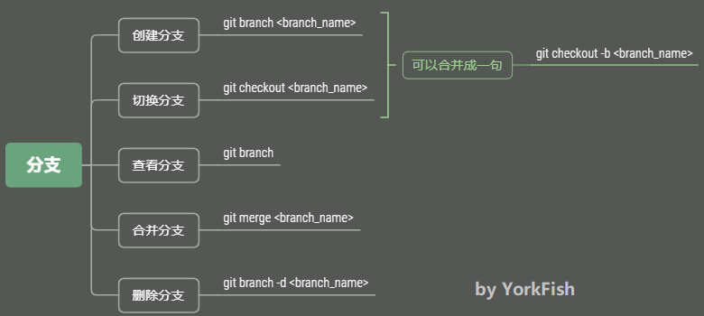

# 19. branch

## 1. 回顾

- 此命令与 `git checkout -- <file>` 相似但**不同**

## 2. 开启“平行宇宙”

### 2.1 目前的状态


### 2.2 添加分支

```bash
York@DESKTOP MINGW64 /d/git/git_note (master)
$ git branch dev

York@DESKTOP MINGW64 /d/git/git_note (master)
$ git checkout dev
Switched to branch 'dev'

York@DESKTOP MINGW64 /d/git/git_note (dev)
$ 
```

!!! note "补充"
    - 添加命令与切换命令可以合成一句 `git checkout -b dev`
    - 切换分支后，路径右边的括号中的显示会发生相应变化
    - 每次切换分支，都会生成记录

### 2.3 查看分支

1. 查看分支情况

    ```bash
    York@DESKTOP MINGW64 /d/git/git_note (dev)
    $ git branch
    * dev
      master
    ```

2. 目前的情况

    

3. 在 `dev` 分支添加一个文件 `dev_01.txt` 并 `add` + `commit`

    ```bash
    York@DESKTOP MINGW64 /d/git/git_note (dev)
    $ touch dev_01.txt

    York@DESKTOP MINGW64 /d/git/git_note (dev)
    $ git add dev_01.txt

    York@DESKTOP MINGW64 /d/git/git_note (dev)
    $ git commit -m "add dev_01.txt to dev branch"
    [dev a6e6c95] add dev_1.txt to dev branch
     1 file changed, 0 insertions(+), 0 deletions(-)
     create mode 100644 dev_01.txt
    ```

4. 目前的情况

    

5. 切到 `master` 分支

    ```bash
    York@DESKTOP MINGW64 /d/git/git_note (dev)
    $ git checkout master
    Switched to branch 'master'
    Your branch is up to date with 'origin/master'.

    York@DESKTOP MINGW64 /d/git/git_note (master)
    $ 
    ```

6. 在文件管理器中查看 `dev_01.txt`

    

7. 此时的情况
   
    - 因为 `dev_01.txt` 是在 `dev` 分支添加的，所以 `master` 分支没有这个文件

### 2.4 合并分支

- 命令：`git merge <branch_name>`

    ```bash
    York@DESKTOP MINGW64 /d/git/git_note (master)
    $ git merge dev
    Updating 3f06ce7..a6e6c95
    Fast-forward
     dev_01.txt | 0
     1 file changed, 0 insertions(+), 0 deletions(-)
     create mode 100644 dev_01.txt
    ```

- 上图的 `Fast-forward` 说明
    - 这次合并用的是“快进模式”
    - 即，直接把 `master` 指向 `dev` 的“当前提交”，所以合并速度非常快
    - 不过不是每次合并都能 `Fast-forward`
- 目前的情况

    

### 2.5 删除分支

```bash
York@DESKTOP MINGW64 /d/git/git_note (master)
$ git branch
  dev
* master

York@DESKTOP MINGW64 /d/git/git_note (master)
$ git branch -d dev
Deleted branch dev (was a6e6c95).

York@DESKTOP MINGW64 /d/git/git_note (master)
$ git branch
* master
```

- 目前的情况

    

## 3. 小结



***

## 补充

- `git switch -c dev` 同 `git checkout -b dev`
- `git switch master` 同 `git checkout master`
