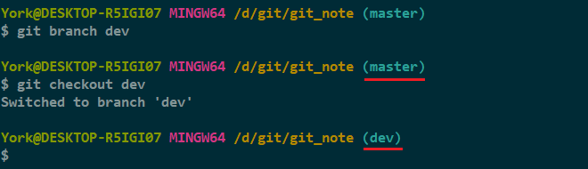
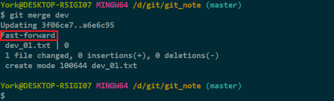
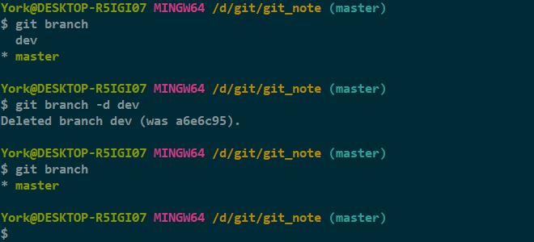
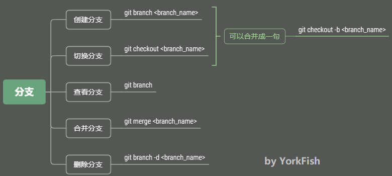

# *branch & checkout branch*

## 1. 回顾

- 此命令与 `git checkout -- <file>` 相似但**不同**

## 2. 开启“平行宇宙”

### 2.1 目前的状态

### 2.2 添加分支

- 添加命令：`git branch <branch_name>`
- 切换命令：`git checkout <branch_name>`

    

#### 补充

- 添加命令与切换命令可以合成一句
    - 命令：`git checkout -b dev`
    - *b for branch*
- 切换分支后，路径右边的括号中的显示会发生相应变化
- 每次切换分支，都会生成记录

### 2.3 查看分支

1. 查看命令：`git branch`

    ./imgs/19-03_git_branch.png)

2. 目前的情况

    ./imgs/19-04_now_status.png)

3. 在 *dev* 分支添加一个文件 *dev_01.txt* 并 `add` + `commit`

    ./imgs/19-05_touch&add_commit.png)

4. 目前的情况

    ./imgs/19-06_now_status.png)

5. 切到 *master* 分支

    

6. 在文件管理器中查看 *dev_01.txt*

    

7. 此时的情况
   
    - 因为 *dev_01.txt* 是在 *dev* 分支添加的，所以 *master* 分支没有这个文件

### 2.4 合并分支

- 命令：`git merge <branch_name>`

    

- 上图的 *Fast-forward* 说明
    - 这次合并用的是“快进模式”
    - 即，直接把 *master* 指向 *dev* 的“当前提交”，所以合并速度非常快
    - 不过不是每次合并都能 *Fast-forward*
- 目前的情况

    

### 2.5 删除分支

- 命令：`git branch -d <branch_name>`

    

- 目前的情况

    

## 3. 小结

