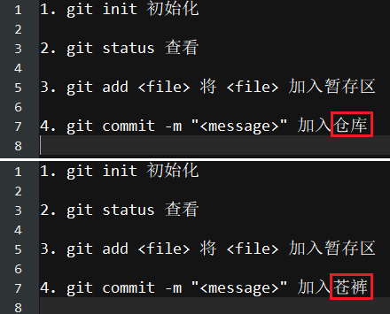
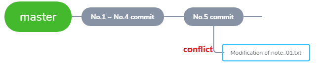

# 20. 制造冲突（一）

!!! info
    GitHub 上的操作 > <a href="https://yorkfish.github.io/blogs/git/github/08-merge-branches/" target="_blank">08 合并分支</a> 文末提及了“解决冲突”，这回详谈

## 没有条件，创造条件

!!! failure
    这回是失败案例~

1. 新建一条分支，并切换至该分支

    ```bash
    York@DESKTOP MINGW64 /d/git/git_note (master)
    $ git branch
    * master

    York@DESKTOP MINGW64 /d/git/git_note (master)
    $ git checkout -b conflict
    Switched to a new branch 'conflict'

    York@DESKTOP MINGW64 /d/git/git_note (conflict)
    $ 
    ```

2. 打开 `note_01.txt` 并修改（修改前后的区别已用<font color="red">红框</font>框出）

    

3. `add` + `commit`

    ```bash
    York@DESKTOP MINGW64 /d/git/git_note (conflict)
    $ git add note_01.txt

    York@DESKTOP MINGW64 /d/git/git_note (conflict)
    $ git commit -m "Modification of note_01.txt"
    [conflict ad80cbd] Modification of note_01.txt
     1 file changed, 1 insertion(+), 1 deletion(-)
    ```

4. 切换至 `master` 分支

    ```bash
    York@DESKTOP MINGW64 /d/git/git_note (conflict)
    $ git checkout master
    Switched to branch 'master'
    Your branch is ahead of 'origin/master' by 1 commit.
      (use "git push" to publish your local commits)

    York@DESKTOP MINGW64 /d/git/git_note (master)
    $ 
    ```

5. 上方有个提示
    - `Your branch is ahead of 'origin/master' by 1 commit.`
    - 当前分支 `master` 比远程仓库多一次 `commit`

6. 目前的情况

    

7. 合并

    ```bash
    York@DESKTOP MINGW64 /d/git/git_note (master)
    $ git merge conflict
    Updating a6e6c95..ad80cbd
    Fast-forward
     note_01.txt | 2 +-
     1 file changed, 1 insertion(+), 1 deletion(-)

    York@DESKTOP MINGW64 /d/git/git_note (master)
    $ git status
    On branch master
    Your branch is ahead of 'origin/master' by 2 commits.
      (use "git push" to publish your local commits)

    nothing to commits, working tree clean
    ```

!!! note "分析"
    - `conflict` 分支的内容覆盖了之前的内容
    - 并没有产生冲突
    - 主要原因：主分支的 `note_01.txt` 并没有变动
