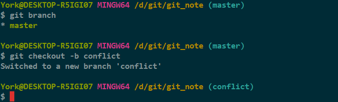
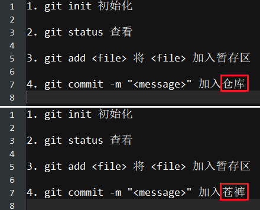
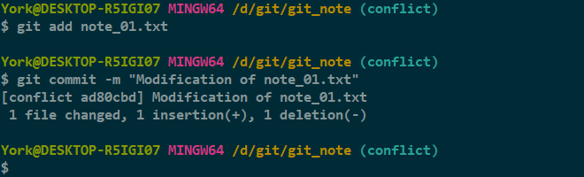
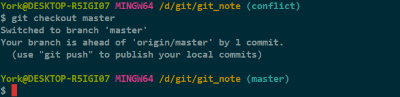
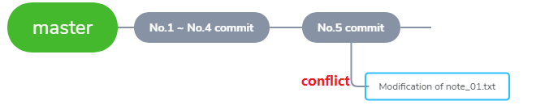
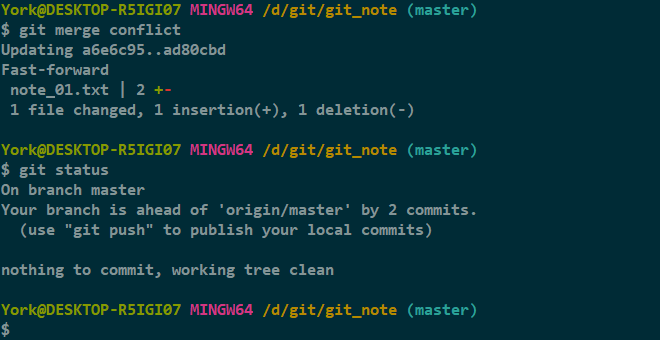

# 制造冲突 一

- 《*GitHub* 上的操作》<a href="" target="_blank">07_合并分支</a> 文末提及了“解决冲突”，这回详谈

## 没有条件，创造条件

注：这回是失败案例

1. 新建一条分支，并切换至该分支

    

2. 打开 *note_01.txt* 并修改（修改前后的区别已用红框框出）

    

3. `add` + `commit`

    

4. 切换至 *master* 分支

    

- 上图有个提示
    - `Your branch is ahead of 'origin/master' by 1 commit.`
    - 当前分支 (master) 比远程仓库多一次 *commit*

- 目前的情况

    

5. 合并

    

### 分析

- *conflict* 分支的内容覆盖了之前的内容
- 并没有产生冲突
- 主要原因：主分支的 *note_01.txt* 并没有变动