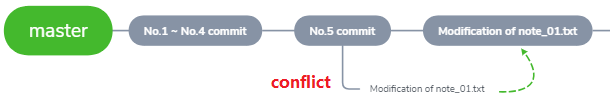

# 21. 制造冲突（二）

## 没有条件，创造条件

!!! failure
    这回也是失败案例~

1. 目前的情况

    

2. 修改 `master` 分支的 `note_01.txt`

    ```
    1. git init 初始化

    2. git status 查看

    3. git add <file> 将 <file> 加入暂存区

    4. git commit -m "<message>" 加入仓库

    5. master

    ```
    
3. `add`
   
    ```bash
    York@DESKTOP MINGW64 /d/git/git_note (master)
    $ git add note_01.txt
    ```
    
4. 切到 `conflict` 分支

    ```bash
    York@DESKTOP MINGW64 /d/git/git_note (master)
    $ git checkout conflict
    Switched to branch 'conflict'
    M       note_01.txt

    York@DESKTOP MINGW64 /d/git/git_note (conflict)
    $ 
    ```

5. 修改 `note_01.txt`

    ```
    1. git init 初始化

    2. git status 查看

    3. git add <file> 将 <file> 加入暂存区

    4. git commit -m "<message>" 加入仓库

    5. conflict

    ```

6. `add`

    ```bash
    York@DESKTOP MINGW64 /d/git/git_note (conflict)
    $ git add note_01.txt
    ```

7. 切回 `master` 并合并

    ```bash
    York@DESKTOP MINGW64 /d/git/git_note (conflict)
    $ git checkout master
    Switched to branch 'master'
    M       note_01.txt
    Your branch is ahead of 'origin/master' by 2 commits.
      (use "git push" to publish your local commits)
    
    York@DESKTOP MINGW64 /d/git/git_note (master)
    $ git merge conflict
    Already up to date
    ```

!!! note "分析"
    - `conflict` 分支的内容覆盖了之前的内容
    - 并没有产生冲突
    - 主要原因：没有 `commit`
