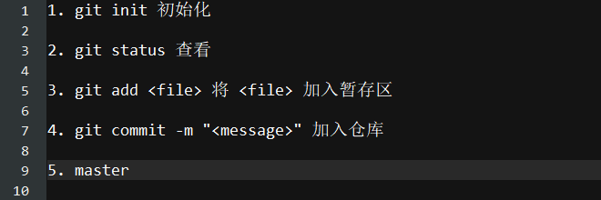
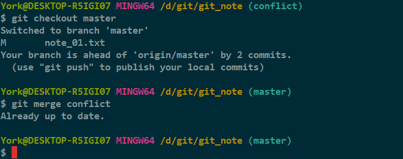

# 制造冲突 二

## 没有条件，创造条件

注：这回也是失败案例

1. 目前的情况

    

2. 修改 *master* 分支的 *note_01.txt*
   

    
    
3. `add`
   
    
    
4. 切到 *conflict* 分支

    

5. 修改 *note_01.txt*

    

6. `add`

    

7. 切回 *master* 并合并

    

### 分析

- *conflict* 分支的内容覆盖了之前的内容
- 并没有产生冲突
- 主要原因：没有 `commit`