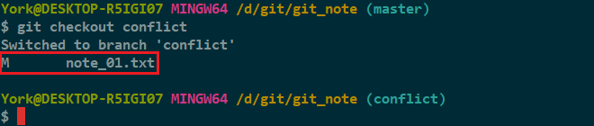
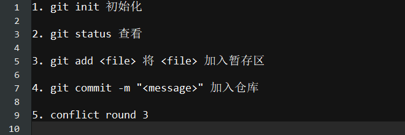
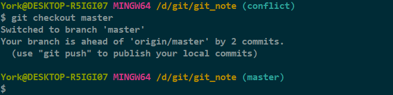
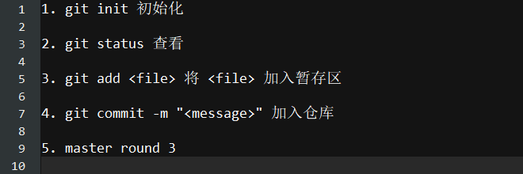
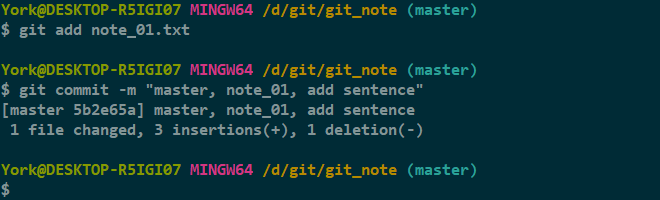
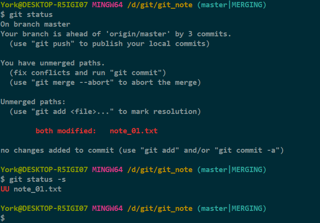
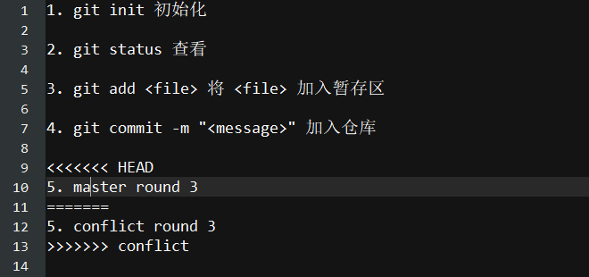

# 制造冲突 三

- 注：这回是成功案例

## 1.目前的情况

## 2. 切到 *conflict* 分支

- 上图红框处是因为当时在 *master* 分支的工作区对 *note_01.txt* 有所变动

## 3. 修改 *conflict* 分支下的 *note_01.txt*

- *记得保存*

## 4. *add* + *commit*

## 5. 切回 *master* 分支

## 6. 修改 *master* 分支下的 *note_01.txt*

- 记得保存

## 7. *add* + *commit*

## 8. 合并

### 分析

- 产生冲突
    - *note_01.txt* 存在冲突
    - 必须手动解决冲突后再提交

## 9. 查看一下状态

## 10. 查看 *note_01.txt*

### 说明

- 冲突后，*Git* 会把冲突的地方列出来
- 类似这样

        <<<<<<< HEAD
        ...
        =======
        ...
        >>>>>>> branch_name