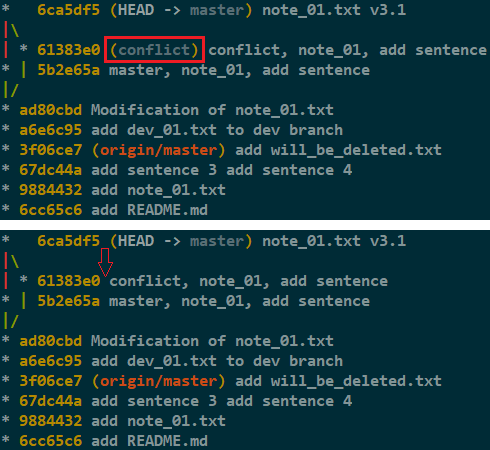
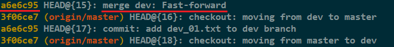
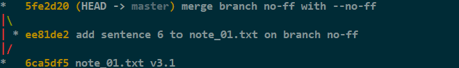
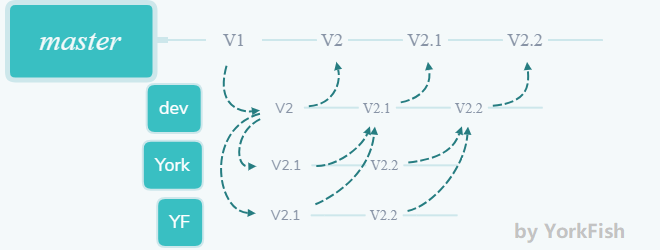

# 24. merge

## 1. Fast-forward

### 1.1 特性回顾

- Git 在合并分支时会尽可能地使用 `Fast-forward`
- 例子见 <a href="https://yorkfish.github.io/blogs/git/gitbash/19-branch-and-checkout-branch/" target="_blank">19 新建分支与切换分支</a> 的 `2.4 合并分支`

### 1.2 缺点

- `Fast-forward` 这种模式在删除分支后会丢失该分支的信息

### 1.3 举例

1. 目前的情况

    ```bash
    York@DESKTOP MINGW64 /d/git/git_note (master)
    $ git branch
      conflict
    * master

    York@DESKTOP MINGW64 /d/git/git_note (master)
    $ git log --oneline --graph
    *   6ca5df5 (HEAD -> master) note_01.txt v3.1
    |\
    | * 61383e0 (conflict) conflict, note_01, add sentence
    * | 5b2e65a master, note_01, add sentence
    |/
    * ad80cbd Modification of note_01.txt
    * a6e6c95 add dev_01.txt to dev branch
    * 3f06ce7 (origin/master) add will_be_deleted.txt
    * 67dc44a add sentence 3 add sentence 4
    * 9884432 add note_01.txt
    * 6cc65c6 add README.md
    ```

2. 删除 `conflict` 分支

    ```bash
    York@DESKTOP MINGW64 /d/git/git_note (master)
    $ git branch -d conflict

    York@DESKTOP MINGW64 /d/git/git_note (master)
    $ git branch
      conflict
    * master

    York@DESKTOP MINGW64 /d/git/git_note (master)
    $ git log --oneline --graph
    *   6ca5df5 (HEAD -> master) note_01.txt v3.1
    |\
    | * 61383e0 conflict, note_01, add sentence
    * | 5b2e65a master, note_01, add sentence
    |/
    * ad80cbd Modification of note_01.txt
    * a6e6c95 add dev_01.txt to dev branch
    * 3f06ce7 (origin/master) add will_be_deleted.txt
    * 67dc44a add sentence 3 add sentence 4
    * 9884432 add note_01.txt
    * 6cc65c6 add README.md
    ```

3. 删除 `conflict` 分支前后的图像

    

## 2. merge 的参数

### 2.1 准备一条名为 `no-ff` 的分支

1. 使用命令 `git checkout -b no-ff` 创建并切至分支

    ```bash
    York@DESKTOP MINGW64 /d/git/git_note (master)
    $ git checkout -b no-ff
    Switched to a new branch 'no-ff'

    York@DESKTOP MINGW64 /d/git/git_note (no-ff)
    $ 
    ```

2. 修改 `note_01.txt`

    ```
    1. git init 初始化

    2. git status 查看

    3. git add <file> 将 <file> 加入暂存区

    4. git commit -m "<message>" 加入仓库

    5. master round 3.1

    6. no-ff

    ```

3. `add` + `commit`

    ```bash
    York@DESKTOP MINGW64 /d/git/git_note (no-ff)
    $ git add note_01.txt

    York@DESKTOP MINGW64 /d/git/git_note (no-ff)
    ```

4. 切回 `master` 分支

    ```bash
    York@DESKTOP MINGW64 /d/git/git_note (no-ff)
    $ git checkout master
    Switched to branch 'master'
    Your branch is ahead of 'origin/master' by 5 commits.
      (use "git push" to publish your local commits)

    York@DESKTOP MINGW64 /d/git/git_note (master)
    $ 
    ```

### 2.2 git merge \-\-no\-ff \-m ""

- `--no-ff` 意味着禁用 `Fast-forward`
- 因为这次操作会创建一个新的 `commit`，所以加上 `-m` 参数并写一句注释

    ```bash
    York@DESKTOP MINGW64 /d/git/git_note (master)
    $ git merge --no-ff -m "merge branch no-ff with --no-ff" no-ff
    Merge made by the 'recursive' strategy.
     note_01.txt | 2 ++
     1 file changed, 2 insertions(+)
    ```

- 查看一下历史图像

    ```bash
    York@DESKTOP MINGW64 /d/git/git_note (master)
    $ git log --oneline --graph
    *   5fe2d20 (HEAD -> master) merge branch no-ff with --no-ff
    |\
    | * ee81de2 (no-ff) add sentence 6 to note_01.txt on branch no-ff
    |/
    *   6ca5df5 (HEAD -> master) note_01.txt v3.1
    |\
    | * 61383e0 conflict, note_01, add sentence
    * | 5b2e65a master, note_01, add sentence
    |/
    * ad80cbd Modification of note_01.txt
    * a6e6c95 add dev_01.txt to dev branch
    * 3f06ce7 (origin/master) add will_be_deleted.txt
    * 67dc44a add sentence 3 add sentence 4
    * 9884432 add note_01.txt
    * 6cc65c6 add README.md
    ```

#### 分析

- 其实上方中有三次合并操作，而左侧的“起伏”只有两次
- `Fast-forward` 会导致删除分支后丢失该分支的信息
- 我截了张 `reflog` 的图以证明 `a6e6c95` 曾是分支

    

- 我删除 `no-ff` 分支后又截了张 `log` 图
- 虽然 `(no-ff)` 被删除了，但左侧的“起伏”还在
- `--no-ff` 参数可以使合并后仍能看出来曾经的痕迹

    

## 3. 分支策略

- 在实际开发过程中
    - `master` 分支需要非常稳定，仅用来发布新版本，平时不在上面干活
    - `dev` 分支并不稳定，因为平时在这里干活
    - 如果要发布新版本，就把 `dev` 分支合并到 `master` 分支上
    - 可能许多人都是从 `dev` 分支上再开分支干活，干完活后往 `dev` 分支上合并，以此类推
- 示意图

    
