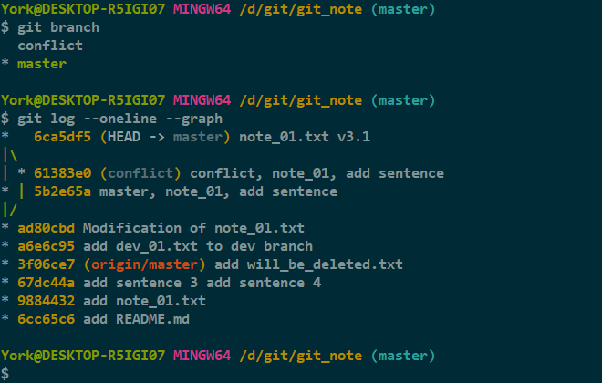
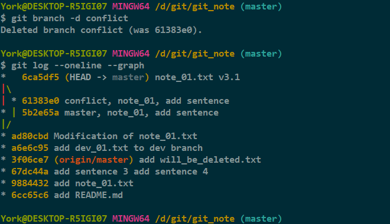
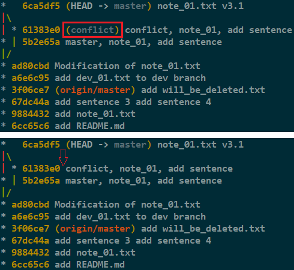
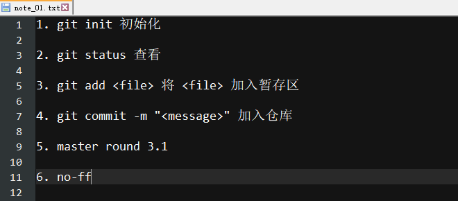
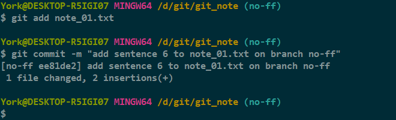
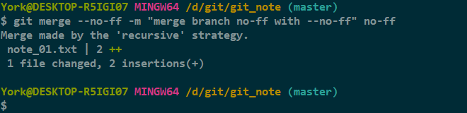
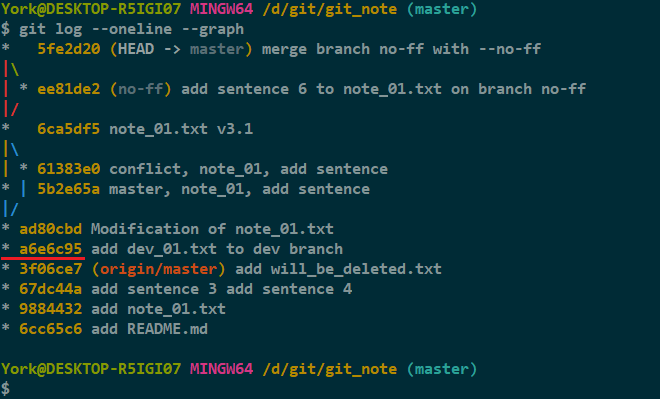
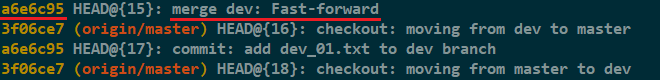
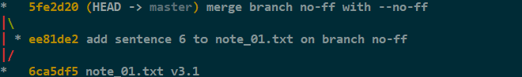

# merge

## 1. *Fast-forward*

### 1.1 特性回顾

- *Git* 在合并分支时会尽可能地使用 *Fast-forward*
- 例子见 <a href="https://yorkfish.github.io/blogs/Git/GitBash/19_branch&checkout_branch/" target="_blank">19_branch&checkout_branch</a> 的 *2.4 合并分支*

### 1.2 缺点举例

- *Fast-forward* 这种模式在删除分支后会丢失该分支的信息

1. 目前的情况

    

2. 删除 *conflict* 分支

    

3. 删除 *conflict* 分支前后的图像

    

## 2. *merge* 的参数

### 2.1 准备一条名为 *no\-ff* 的分支

1. 使用命令 `git checkout -b no-ff` 创建并切至分支

    

2. 修改 *note_01.txt*

    

3. `add` + `commit`

    

4. 切回 *master* 分支

    

### 2.2 *git merge \-\-no-ff \-m "<message\>"*

- `--no-ff` 意味着
    - 禁用 *Fast\-forward*
    - 合并也是一种 `commit`，所以用 `-m` 加一句“注释”

        

- 查看一下历史图像

    

#### 分析

- 其实上图中有三次合并操作
- 我截了张 *reflog* 的图

    

- 这里再次说明了

    - *Fast\-forward* 这种模式会使得删除分支后丢失该分支的信息
    - `--no-ff` 参数可以使合并后仍能看出来曾经的痕迹

    

## 3. 分支策略

- 在实际开发过程中
    - *master* 分支需要非常稳定，仅用来发布新版本，平时不在上面干活
    - *dev* 分支并不稳定，因为平时在这里干活
    - 如果要发布新版本，就把 *dev* 分支合并到 *master* 分支上
    - 可能许多人都是从 *dev* 分支上再开分支干活，干完活后往 *dev* 分支上合并，以此类推
- 示意图

    
