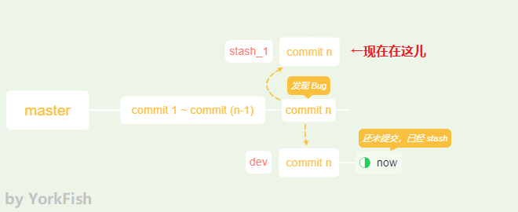

# 25. stash - I

## 1. 情景描述


- 在 `dev` 分支工作时，发现 `master` 那边有个 bug
- `master` 那边的 bug 需要立即修复，`dev` 这里却只做到一半
- 若在 `dev` 分支中没有提交就切到 `master` 分支，`dev` 的最新改动会被覆盖
- Git 有如下提示

    ```
    error: Your local changes to the following files would be overwritten by checkout:
    ...
    Please commit your changes or stash them before you switch branches.
    Aborting
    ```

## 2. 解决问题

### 2.1 没有条件，创造条件

1. 目前的情况

    

2. 开一条分支 `dev`，切到该分支，再新建一个文档 `note_02.txt`
   
    ```bash
    York@DESKTOP MINGW64 /d/git/git_note (master)
    $ git checkout -b dev
    Switched to a new branch 'dev'

    York@DESKTOP MINGW64 /d/git/git_note (dev)
    $ touch note_02.txt
    ```

4. 往 `note_02.txt` 中写入文字，并保存

    ```
    I am working.
    ```

5. 往 `note_01.txt` 中添加文字，并保存

    ```
    1. git init 初始化

    2. git status 查看

    3. git add <file> 将 <file> 加入暂存区

    4. git commit -m "<message>" 加入仓库

    5. master round 3.1

    6. no-ff

    7. stash

    ```

5. 查看当前状态

    ```bash
    York@DESKTOP MINGW64 /d/git/git_note (dev)
    $ git status
    On branch dev
    Changes not staged for commit:
      (use "git add <file>..." to update what will be committed)
      (use "git checkout -- <file>..." to discard changes in working directory)

            modified:  note_01.txt

    Untracked files:
      (use "git add <file>..." to include in what will be committed)

            note_02.txt

    no changes added to commit (use "git add" and/or "git commit -a")
    ```

### 2.2 git stash

```bash
York@DESKTOP MINGW64 /d/git/git_note (dev)
$ git stash
Saved working directory and index state WIP on dev: 5fe2d20 merge branch no-ff with --no-ff

York@DESKTOP MINGW64 /d/git/git_note (dev)
$ git status
On branch dev
Untracked files:
  (use "git add <file>..." to include in what will be committed)

        note_02.txt

nothing added to commit but untracked files present (use "git add" to track)
```

!!! note "分析"
    因为 `note_02.txt` 一次也没有添加至暂存区过，所以有个反馈

### 2.3 开始解决 bug

1. 切到 `master` 分支，另开一条分支 `stash_1`，并切入

    ```bash
    York@DESKTOP MINGW64 /d/git/git_note (dev)
    $ git checkout master
    Switched to branch master
    Your branch is ahead of 'origin/master' by 7 commits.
      (use "git push" to publish your local commits)

    York@DESKTOP MINGW64 /d/git/git_note (master)
    $ git checkout -b stash_1
    Switched to a new branch 'stash_1'

    York@DESKTOP MINGW64 /d/git/git_note (stash_1)
    $ 
    ```

2. 此时的情况

    

3. 打开 `note_01.txt`，将 `5. master round 3.1` 中的 `round` 改为 `version`，并保存

    ```
    1. git init 初始化

    2. git status 查看

    3. git add <file> 将 <file> 加入暂存区

    4. git commit -m "<message>" 加入仓库

    5. master version 3.1

    6. no-ff

    7. stash

    ```

4. `add` + `commit`

    ```bash
    York@DESKTOP MINGW64 /d/git/git_note (stash_1)
    $ git add note_01.txt

    York@DESKTOP MINGW64 /d/git/git_note (stash_1)
    $ git commit -m "replace round with version"
    [stash_1 3775618] replace round with version
     1 file changed, 1 insertion(+), 1 deletion(-)
    ```

5. 切到 `master` 分支，再合并 `stash_01` 分支（`--no-ff` 见下一篇）

    ```bash
    York@DESKTOP MINGW64 /d/git/git_note (stash_1)
    $ git checkout master
    Switched to branch 'master'
    Your branch is ahead of 'origin/master' by 7 commits.
      (use "git push" to publish your local commits)

    York@DESKTOP MINGW64 /d/git/git_note (master)
    $ git merge stash_1
    Updating 5fe2d20..3775618
    Fast-forward
     note_01.txt | 2 +-
     1 file changed, 1 insertion(+), 1 deletion(-)
    ```

6. 删除 `stash_1` 分支，并查看

    ```bash
    York@DESKTOP MINGW64 /d/git/git_note (master)
    $ git branch -d stash_1
    Deleted branch stash_1 (was 3775618).

    York@DESKTOP MINGW64 /d/git/git_note (master)
    $ git status
    On branch master
    Your branch is ahead of 'origin/master' by 8 commits.
      (use "git push" to publish your local commits)

    Untracked files:
      (use "git add <file>..." to include in what will be committed)

            note_02.txt

    nothing added to commit but untracked files present (use "git add" to track)
    ```

## 3. 回到之前的工作状态

### 3.1 git stash list

```bash
York@DESKTOP MINGW64 /d/git/git_note (master)
$ git stash list
stash@{0}:WIP on dev: 5fe2d20 merge branch no-ff with --no-ff
```

- `stash@{0}` 有点像 `git reflog` 的 `HEAD@{n}`
- `git stash` 可以在多处使用
    - 在恢复时选择指定的序号即可
    - 相关命令：`git stash apply stash@{n}`

### 3.2 git stash apply

```bash
York@DESKTOP MINGW64 /d/git/git_note (master)
$ git checkout dev
Switched to branch 'dev'

York@DESKTOP MINGW64 /d/git/git_note (dev)
$ git stash apply
On branch dev
Changes not staged for commit:
  (use "git add <file>..." to update what will be committed)
  (ue "git checkout -- <file>..." to discard changes in working directory)

    modified:  note_01.txt

Untracked files:
  (use "git add <file>..." to include in what will be committed)

    note_02.txt

no changes added to commit (use "git add" and/or "git commit -a")

York@DESKTOP MINGW64 /d/git/git_note (dev)
$ git stash drop
Dropped refs/stash@{0} (db5812e646ea3e94ca837c3da804d9158714db94)
```

!!! note "恢复方法有两种"
    1. 方法一：`git stash apply` + `git stash drop`
    2. 方法二：`git stash pop`

## 4. 问题解决，查看记录

```bash
York@DESKTOP MINGW64 /d/git/git_note (dev)
$ git log --oneline --graph
*   5fe2d20 (HEAD -> master) merge branch no-ff with --no-ff
|\
| * ee81de2 (no-ff) and sentence 6 to note_01.txt on branch no-ff
|/
*   6ca5df5 note_01.txt v3.1
|\
| * 61383e0 conflict, note_01, add sentence
* | 5b2e65a master, note_01, add sentence
|/
* ad80cbd Modification of note_01.txt
* a6e6c95 add dev_01.txt to dev branch
* 3f06ce7 (origin/master) add will_be_deleted.txt
* 67dc44a add sentence 3 add sentence 4
* 9884432 add note_01.txt
* 6cc65c6 add README.md
```

- 结论
    - 没有增加提交次数
    - 哈希值也没有变
