# stash 之一

## 1. 情景描述

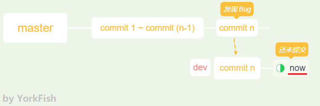

- 在 *dev* 分支工作时，发现 *master* 那边有个 *bug*
    - *master* 那边的 *bug* 需要立即修复
    - *dev* 这里却只做到一半
    - 若在 *dev* 分支中没有提交就切到 *master* 分支，*dev* 的最新改动会被覆盖
    - *Git* 有如下提示

            error: Your local changes to the following files would be overwritten by checkout:
            ...
            Please commit your changes or stash them before you switch branches.
            Aborting

## 2. 解决问题

### 2.1 没有条件，创造条件

1. 目前的情况

    

2. 开一条分支 *dev*，切到该分支，再新建一个文档 *note_02.txt*
   
    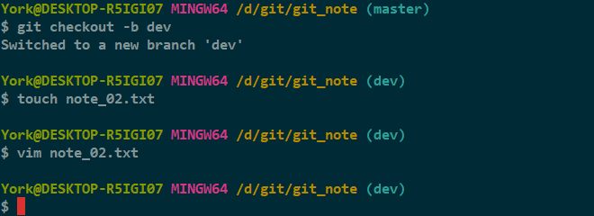

4. 往 *note_02.txt* 中写入文字，并保存

    

5. 往 *note_01.txt* 中添加文字，并保存

    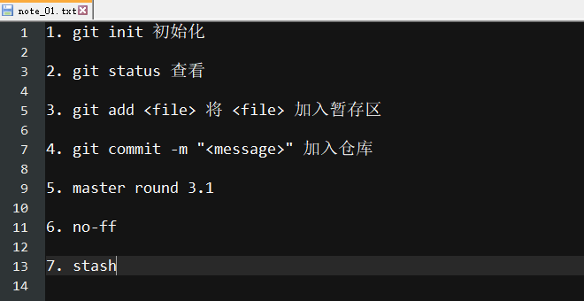

5. 查看当前状态

    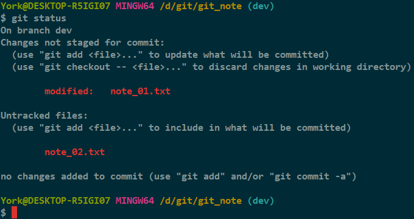

### 2.2 *git stash*

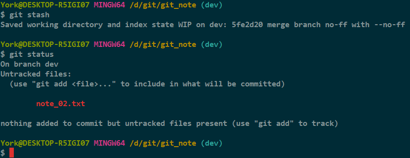

#### 分析

- 因为 *note_02.txt* 一次也没有添加至暂存区过，所以有个反馈

### 2.3 开始解决 *Bug*

1. 切到 *master* 分支，另开一条分支 *stash_1*，并切入

    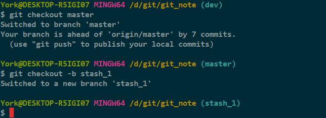

2. 此时的情况

    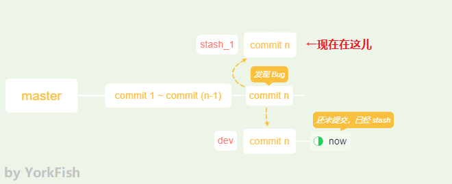

3. 打开 *note_01.txt*，将 `5. master round 3.1` 中的 *round* 改为 *version*，并保存

    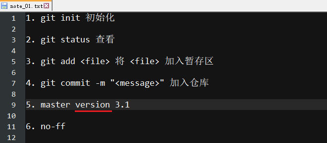

4. `add` + `commit`

    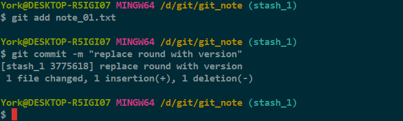

5. 切到 *master* 分支，再合并 *stash_01* 分支
    - 这里没有使用 `--no-ff`，下一篇有

    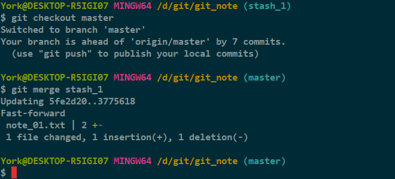

6. 删除 *stash_1* 分支，并查看

    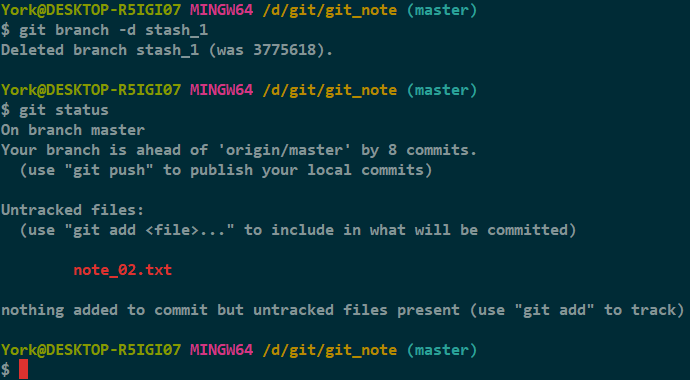

## 3. 回到之前的工作状态

### 3.1 *git stash list*

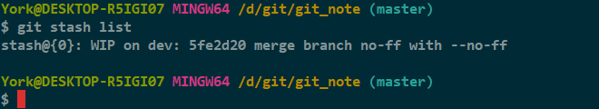

- 此命令有些像 `git reflog`，比如 `stash@{0}` 与 `HEAD@{n}`
- 可以多次使用 `git stash`
    - 只要在恢复时选择指定的序号即可
    - 相关命令：`git stash apply stash@{n}`

### 3.2 *git stash apply*

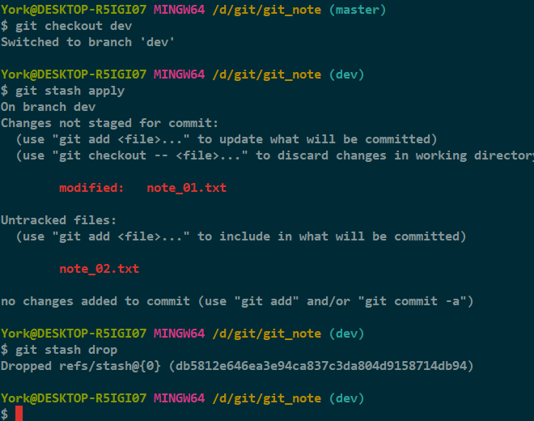

#### 说明

- 恢复有两种方法供选
    1. 方法一：`git stash apply` + `git stash drop`
    2. 方法二：`git stash pop`

## 4. 问题解决，查看记录

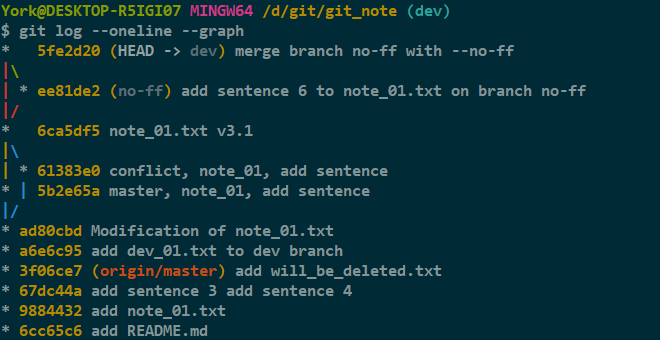

- 结论
    - 没有增加提交次数
    - 哈希值也没有变