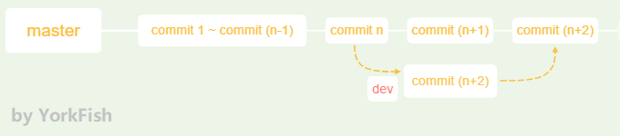

# 26. stash - II

## 1. 情景描述


- 在 `dev` 分支工作时，得知 `master` 那边有个 bug
- `master` 那边的 bug 需要立即修复，`dev` 这里却只做到一半
- 若在 `dev` 分支中没有提交就切到 `master` 分支，`dev` 的最新改动会被覆盖

## 2. 解决问题

### 2.1 准备

#### add

- 在 `dev` 分支下 `add`

    ```bash
    York@DESKTOP MINGW64 /d/git/git_note (dev)
    $ git add .
    warning: LF will be replaced by CRLF in note_02.txt.
    The file will have its origin line endings in your working directory

    York@DESKTOP MINGW64 /d/git/git_note (dev)
    $ git status
    On branch dev
    Changes to be committed:
      (use "git reset HEAD <file>..." to unstage)

            modified:  note_01.txt
            new file:  note_02.txt

    Changes not staged for commit:
      (use "git add <file>..." to update what will be committed)
      (use "git checkout -- <file>..." to discard changes in working directory)

            modified:  note_02.txt

    ```

- 因为 `note_02.txt` 是在 Git Bash 下用 `vim` 写入数据的，所以有个格式提醒
- 我先给 `note_02.txt` 转了格式后，再用的 `git status`，所以 Git 有个 <font color="red">modified</font> 提示

#### add + commit

- 对 `note_02.txt` 进行 `add`，然后 `commit`

    ```bash
    York@DESKTOP MINGW64 /d/git/git_note (dev)
    $ git add note_02.txt

    York@DESKTOP MINGW64 /d/git/git_note (dev)
    $ git status
    On branch dev
    Changes to be committed:
      (use "git reset HEAD <file>..." to unstage)

            modified:  note_01.txt
            new file:  note_02.txt
    ```


    York@DESKTOP MINGW64 /d/git/git_note (dev)
    $ git commit -m "update note_01.txt, add note_02.txt"
    [dev 2f50c6e] update note_01.txt, add note_02.txt
     2 files changed, 3 insertions(+)
     create mode 100644 note_02.txt
    ```

#### merge

- 切到 `master` 分支并合并

    ```bash
    York@DESKTOP MINGW64 /d/git/git_note (dev)
    $ git checkout master
    Switched to branch 'master'
    Your branch is ahead of 'origin/master' by 8 commits.
      (use "git push" to publish your local commits)

    York@DESKTOP MINGW64 /d/git/git_note (master)
    $ git merge --no-ff -m "note_01.txt v3.3 & add note_02.txt" dev
    Auto-merging note_01.txt
    Merge made by the 'recursive' strategy.
     note_01.txt | 2 ++
     note_02.txt | 1 +
     2 files changed, 3 insertions(+)
     create mode 100644 note_02.txt
    ```

#### 查看历史记录

```bash
York@DESKTOP MINGW64 /d/git/git_note (master)
$ git log --oneline --graph
*   df6d3be (HEAD -> master) note_01.txt v3.3 & add note_02.txt
|\
| * 2f50c6e (dev) update note_01.txt, add note_02.txt
* | 3775618 replace round with version
|/
*   5fe2d20 merge branch no-ff with --no-ff
|\
| * ee81de2 add sentence 6 to note_01.txt on branch no-ff
|/
*   6ca5df5 note_01.txt v3.1
|\
| * 61383e0 conflict, note_01, add sentence
* | 5b2e65a master, note_01, add sentence
|/
* ad80cbd Modification of note_01.txt
* a6e6c95 add dev_01.txt to dev branch
* 3f06ce7 (origin/master) add will_be_deleted.txt
* 67dc44a add sentence 3 add sentence 4
* 9884432 add note_01.txt
* 6cc65c6 add README.md
```

- 第六行的 `3775618` 是上一篇改完 bug 的产物

### 2.2 创造条件

1. 目前的情况

    

2. 切到 `dev` 分支，更改 `note_01.txt` 并 `add`

    ```bash
    York@DESKTOP MINGW64 /d/git/git_note (master)
    $ git checkout dev
    Switched to branch 'dev'

    York@DESKTOP MINGW64 /d/git/git_note (dev)
    $ git status -s
     M note_01.txt

    York@DESKTOP MINGW64 /d/git/git_note (dev)
    $ git add note_01.txt

    York@DESKTOP MINGW64 /d/git/git_note (dev)
    $ git status -s
    M  note_01.txt
    ```

!!! note "说明"
    - 此时的情况可以类似当成 `1. 情景描述`
    - `note_01.txt` 也已经加入暂存区了

### 2.3 开始修复 Bug

1. `git stash`

    ```bash
    York@DESKTOP MINGW64 /d/git/git_note (dev)
    $ git stash
    Saved working directory and index state WIP on dev: 2f50c6e update note_01.txt, add note_02.txt

    York@DESKTOP MINGW64 /d/git/git_note (dev)
    $ git checkout master
    Switched to branch 'master'
    Your branch is ahead of 'origin/master' by 10 commits.
      (use "git push" to publish your local commits)

    York@DESKTOP MINGW64 /d/git/git_note (master)
    $ git checkout -b stash_2
    Switched to a new branch "stash_2"
    ```

2. 此时，我修改了 `note_01.txt`，特此说明
3. 继续

    ```bash
    York@DESKTOP MINGW64 /d/git/git_note (stash_2)
    $ git status -s
     M note_01.txt

    York@DESKTOP MINGW64 /d/git/git_note (stash_2)
    $ git commit -am "note_01.txt v3.4"
    [stash_2 26f79c4] note_01.txt v3.4
     1 file changed, 1 insertion(+), deletion(-)

    York@DESKTOP MINGW64 /d/git/git_note (stash_2)
    $ git checkout master
    Switched to branch 'master'
    Your branch is ahead of 'origin/master' by 10 commits.
      (use "git push" to publish your local commits)

    York@DESKTOP MINGW64 /d/git/git_note (master)
    $ 
    ```

4. 这次使用 `--no-ff` 与 `pop`

    ```bash
    York@DESKTOP MINGW64 /d/git/git_note (master)
    $ git merge --no-ff -m "note_01.txt v3.4, --no-ff" stash_2
    Merge made by the 'recursive' strategy.
     note_01.txt | 2 +-
     1 file changed, 1 insertion(+), 1deletion(-)

    York@DESKTOP MINGW64 /d/git/git_note (master)
    $ git branch -d stash_2

    York@DESKTOP MINGW64 /d/git/git_note (master)
    $ git checkout dev

    York@DESKTOP MINGW64 /d/git/git_note (dev)
    $ git stash pop
    On branch dev
    Changes not staged for commit:
      (use "git add <file>..." to update what will be committed)
      (use "git checkout -- <file>..." to discard changes in working directory)

            modified:  note_01.txt

    no changes added to commit (use "git add" and/or "git commit -a")
    Dropped refs/stash@{0} (a34f195ab24b9116b69f8439d347bfd3fe1df1ae)
    ```

## 3. 一个注意点

- 我在 `2.2` 的第二步将 `note_01.txt` 加入暂存区了
- 但现在的显示表明暂存区没有收入
- 不过工作区的还在

    ```bash
    York@DESKTOP MINGW64 /d/git/git_note (dev)
    $ git status -s
     M note_01.txt
    ```
