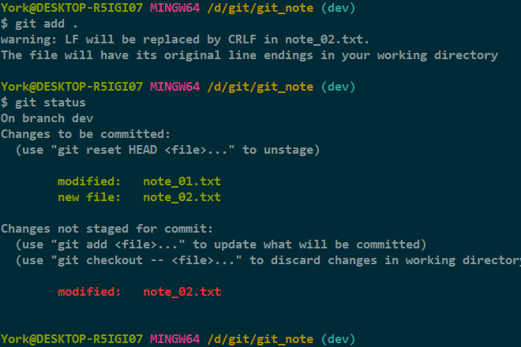
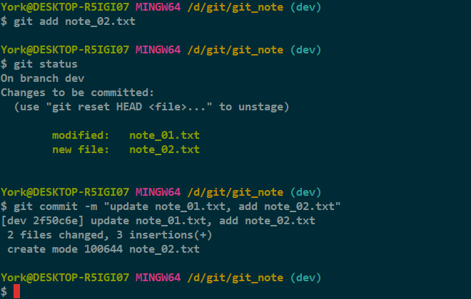
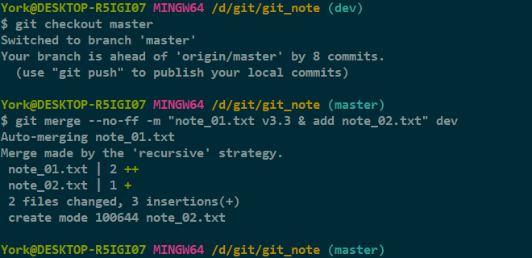
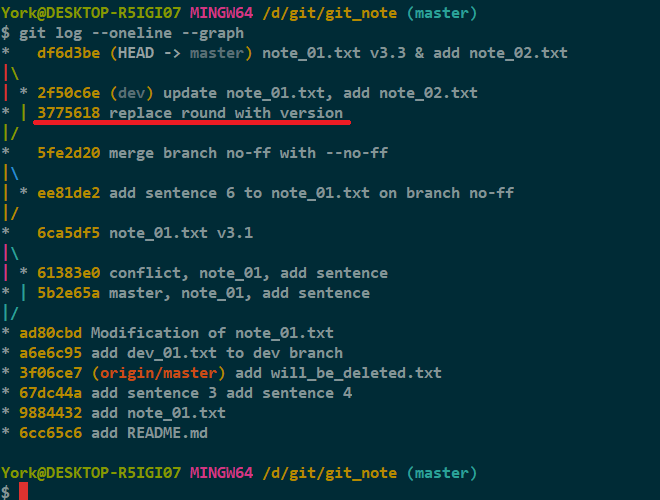
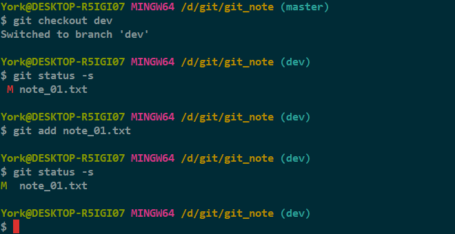
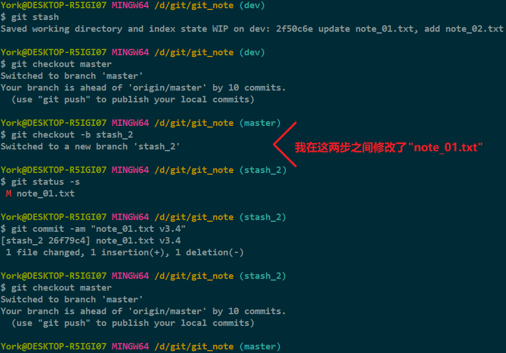
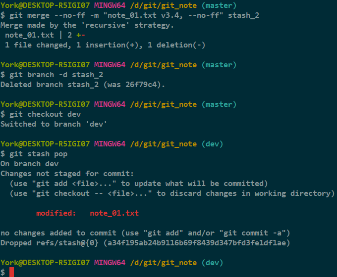
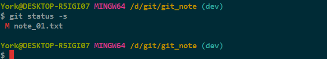

# stash 之二

## 1. 情景描述

- 在 *dev* 分支工作时，得知 *master* 那边有个 *bug*
    - *master* 那边的 *bug* 需要立即修复
    - *dev* 这里却只做到一半
    - 若在 *dev* 分支中没有提交就切到 *master* 分支，*dev* 的最新改动会被覆盖

## 2. 解决问题

### 2.1 准备

1. 在 *dev* 分支下 `add`

    

2. 对 *note_02.txt* 进行 `add`，然后 `commit`

    

3. 切到 *master* 分支并合并

    

4. 查看历史记录

    

#### 说明

- 第一步的图
    - 因为 *note_02.txt* 是在 *Git Bash* 下，用 *vim* 写入数据的，所以有个格式提醒
    - 我给 *note_02.txt* 转了格式后，才用 `git status` 查看，所以 *Git* 有个 modified 提示
- 第四步的图
    - 上图红线处的那个版本是上一篇改完 *bug* 的产物

### 2.2 创造条件

1. 目前的情况

    

2. 切到 *dev* 分支，更改 *note_01.txt* 并 `add`

    

#### 说明

- 此时的情况可以类似当成 `1. 情景描述`

#### 注意

- 这里，我将 *note_01.txt* 加入<u>暂存区</u>了

### 2.3 开始修复 Bug

1. `git stash`

    

2. 这次使用 `--no-ff` 与 `pop`

    

## 3. 一个注意点

- 我在 `2.2` 的第二步将 *note_01.txt* 加入暂存区了
    - 但现在的显示表明暂存区没有收入
    - 不过工作区的还在

    