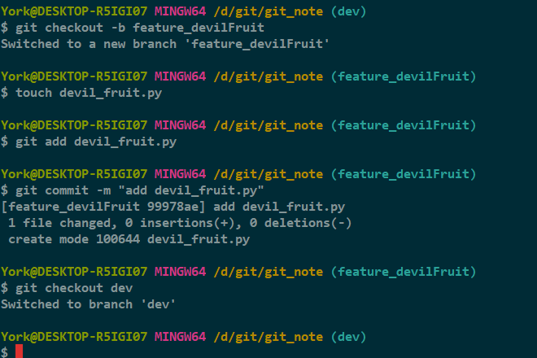
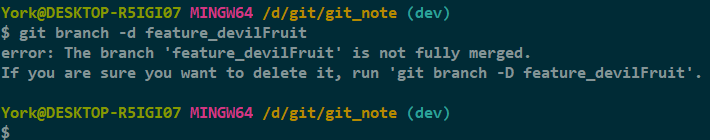

# 删除未合并的分支

## 1. 必要的开场白

### 1.1 需要新的功能时

- 一般会新建一条分支，不妨记为 *feature* 分支
- 在 *feature* 上面开发完成后，合并到指定分支，最后整合到 *master* 分支
- 整合完后，可以删除 *feature* 分支，不过很多时候不删，就让它留着

### 1.2 若开发新功能时情况有变

- *Git* 出于安全的考虑，一般不允许用删除未合并的分支
- 此时想要删除该分支，需要用到新的命令

## 2. 情景模拟

### 2.1 目前的情况

- 我举例用得是之前的仓库
- 目前处在 *dev* 分支，几个文件有所改动，还没提交
- 方便起见，我执行一次 `add` 与 `commit`

### 2.2 开启任务

1. 新开一条分支 *feature_devilFruit*，并切入其中
2. 在该分支做一些变动
3. 返回 *dev* 分支

    

### 2.3 试删 *feature-devilFruit* 分支

- 先试试命令 `git branch -d <branch_name>`

    

#### 结果

- 删除失败

#### 分析

- 失败原因：*Git* 出于安全的考虑，不允许用 `-d` 删除未合并的分支
- 官方提示：确定要删，使用 `-D`

### 2.4 *git branch \-d <branch_name\>*

## 3. 知识小结

1. 开发新功能时，最好新建一个分支
2. 若一定要删除一条未合并的分支，可以使用命令 `git branch -D <branch_name>`