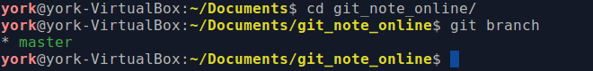

# 28. 推送和拉取

## 1. 补充

- 从远程仓库克隆时，Git 会自动把本地的 `master` 分支和远程的 `master` 分支对应起来
- `push` 需要权限

## 2. 推送分支

### 2.1 目前的情况

- 我的这个仓库之前只推送过一次
- 因为那次是首次，所以使用命令 `git push -u origin master`

### 2.2 同步一波

- 用 `git push origin dev` 命令将 `dev` 分支推上去

    ```bash
    York@DESKTOP MINGW64 /d/git/git_note (dev)
    $ git branch
    * dev
      master

    York@DESKTOP MINGW64 /d/git/git_note (dev)
    $ git push origin master dev
    Enumerating objects: 27, done.
    Counting objects: 100% (27/27), done.
    Delta compression using up to 4 threads
    Conpressing objects: 100% (24/24), done.
    Writing objects: 100 (25/25), 2.09 KiB | 267.00 KiB/s, done.
    Total 25 (delta 15), reused 0 (delta 0)
    remote: Resolving deltas: 100 (15/15), completed with 1 local object.
    remote:
    remote: Create a pull request for 'dev' on GitHub by visiting:
    remote:      https://github.com/YorkFish/git_note_online/pull/new/dev
    remote:
    To github.com:YorkFish/git_note_online.git
     * [new branch]      dev -> dev
    ```

- 既然 `dev` 都推了，那 `master` 也推了吧

    ```bash
    York@DESKTOP MINGW64 /d/git/git_note (dev)
    $ git checkout master
    Switched to branch 'master'
    Your branch is ahead of 'origin/master' by 12 commits.
      (use "git push" to publish your local commits)

    York@DESKTOP MINGW64 /d/git/git_note (master)
    $ git push origin master
    Enumerating objects: 14, done.
    Counting objects: 100% (14/14), done.
    Delta compression using up to 4 threads
    Compressing objects: 100 (10/10), done.
    Writing objects: 100% (10/10), 897 bytes | 299.00 KiB/s, done.
    Total 10 (delta 7), reused 0 (delta 0)
    remote: Resolving deltas: 100% (7/7), completed with 2 local objects.
    To github.com:YorkFish/git_note_online.git
       3f06ce7..0ef8adb  master -> master
    ```

!!! quote "知识点[^1]"
    - 但是，并不是一定要把本地分支往远程推送，那么，哪些分支需要推送，哪些不需要呢？
        - `master` 分支是主分支，因此要时刻与远程同步；
        - `dev` 分支是开发分支，团队所有成员都需要在上面工作，所以也需要与远程同步；
        - `bug` 分支只用于在本地修复 bug，就没必要推到远程了，除非老板要看看你每周到底修复了几个 bug；
        - `feature` 分支是否推到远程，取决于你是否和你的小伙伴合作在上面开发。
    - 总之，就是在 Git 中，分支完全可以在本地自己藏着玩，是否推送，视你的心情而定！

## 3. 拉取分支

### 3.1 一人分饰两角

- 角色介绍
    1. Windows 下的 YorkFish*
    2. Linux 下的 YorkFish

### 3.2 转到 Linux

1. 选一个目录克隆 `git_note_online`

    

2. 克隆结果：只有 `master` 分支被克隆下来了

    

3. `git checkout -b dev origin/dev` 的三个作用
    
    1. 创建并切换分支
    2. 与远程仓库关联
    3. 使本地仓库的 `dev` 分支的内容与远程仓库的一致
4. 操作

    

5. 在 `dev` 分支上将 `note_02.txt` 末尾做好标记

    ```
    I am working.

    I am using Xubuntu.

    ```

6. `push` 到远程仓库

    

### 3.3 回到 Windows

#### 修改

- 在 `dev` 分支修改 `note_02.txt`

    ```bash
    I am working.

    I am using Win10.

    ```

#### add + commit

```bash
York@DESKTOP MINGW64 /d/git/git_note (dev)
$ git add note_02.txt

York@DESKTOP MINGW64 /d/git/git_note (dev)
$ git commit -m "york, dev, note_02.txt v2"
[dev 1c592c1] york, dev, note_02.txt v2
 1 file changed, 2 insertions(+)
```

#### push

```bash
York@DESKTOP MINGW64 /d/git/git_note (dev)
$ git push origin dev
ssh: connect to host github.com port 22: Connection timed out
fatal: Could not read from remote repository.

Please make sure you have the coreect access rights and the repository exists.

York@DESKTOP MINGW64 /d/git/git_note (dev)
$ git push origin dev
To github.com:YorkFish/git_note_online.git
 ! [rejected]        dev -> dev (fetch first)
error: failed to push some refs to 'git@github.com:YorkFish/git_note_online.git'
hint: Updates were rejected because the remote contains work that you do
hint: not have locally. This is usually caused by another repository pushing
hint: to the same ref. You may want to first integrate the remote changes
hint: (e.g., 'git pull ...') before pushing again.
hint: See the 'Note about fast-forwards' in 'git push --help' for details.
```

- 出现了连接超时的现象，这也许是网络不稳定的缘故，我重试后成功连上了
- 虽然连上，但是冲突了！上一回解决冲突见：<a href="https://yorkfish.github.io/blogs/git/gitbash/23-conflict-resolution/" target="_blank">23 解决冲突</a>
- Git 给出了温馨提示：使用 `git pull ...`

#### pull

- 就像商店门上写的一样，进门要**推**，出门要**拉**

    ```bash
    York@DESKTOP MINGW64 /d/git/git_note (dev)
    $ git pull
    remote: Enumerating objects: 5, done.
    remote: Counting objects: 100% (5/5), done.
    remote: Compressing objects: 100% (1/1), done.
    remote: Total 3 (delta 1), reused 3 (delta 1), pack-reused 0
    Unpacking objects: 100% (3/3), done.
    From github.com:YorkFish/git_note_online
       c4495cd..8e7c509  dev        -> origin/dev
    There is no tracking information for the current branch.
    Please specify which branch you want to merge with.
    See git-pull(1) for deltails.

        git pull <remote> <branch>

    If you wish to set tracking information for this branch you can do so with:

        git branch --set-upstream-to=origin/<branch> dev
    ```

- Git 又给了温馨提示
    1. 没有当前分支的跟踪信息
    2. 若要合并某分支，自行查看更多细节
    3. 若要为当前分支设置跟踪信息，可以使用 `git branch --set-upstream-to=origin/dev dev`

#### 按照提示操作

- 设置本地 `dev` 分支与远程 `origin/dev` 分支的链接

    ```bash
    York@DESKTOP MINGW64 /d/git/git_note (dev)
    $ git branch --set-upstream-to=origin/dev dev
    Branch 'dev' set up to track remote branch 'dev' from 'origin'.
    ```

#### pull

```bash
$ git pull
Auto-merging note_02.txt
CONFLICT (content): Merge conflict in note_02.txt
Automatic merge failed; fix conflicts and then commit the result.

York@DESKTOP MINGW64 /d/git/git_note (dev|MERGING)
$ 
```

### 3.4 解决冲突

1. 打开 `note_02.txt`

    ```
    I am working.

    <<<<<<< HEAD
    I am using Win10.
    =======
    I am using Xubuntu.

    >>>>>>> 8e7c5096989478992fbdc7bc2f02a88d8a86e67d
    ```

2. “定稿”

    ```
    I am working.

    I am using Win10 & Xubuntu.

    ```

3. `add` + `commit`

    ```bash
    York@DESKTOP MINGW64 /d/git/git_note (dev|MERGING)
    $ git commit -m "note_02.txt v3"
    [dev a7c568a] note_02.txt v3

    York@DESKTOP MINGW64 /d/git/git_note (dev)
    ```

4. `push`

    ```bash
    York@DESKTOP MINGW64 /d/git/git_note (dev)
    $ git push origin dev
    Enumerating objects: 10, done.
    Counting objects: 100% (10/10), done.
    Delta compression using up to 4 threads
    compressing objects: 100% (4/4), done.
    Writing objects: 100% (6/6), 578 bytes | 192.00 KiB/s, done.
    Total 6 (delta 2), reused 0 (delta 0)
    remote: Resolving deltas: 100% (2/2), completed with 1 local object.
    To github.com:YorkFish/git_note_online.git
      8e7c509..a7c568a  dev -> dev
    ```

## 4. 小结

- 多人团队在合并分支前一般先 `pull`
- 需要注意与远程分支建立**链接**关系

    

[^1]: 这个知识点摘自瘳雪峰老师的《Git教程》
