# “推” & “拉”

## 1. 补充

- 推——push，推送
- 拉——pull，拉取
- 从远程仓库克隆时，*Git* 会自动把本地的 *master* 分支和远程的 *master* 分支对应起来
- `push` 需要权限

## 2. 推送分支

### 2.1 目前的情况

- 我的这个仓库之前只推送过一次
- 因为那次是首次，所以使用命令 `git push -u origin master`

### 2.2 同步一波

- 用 `git push origin dev` 命令将 *dev* 分支“推上去”

    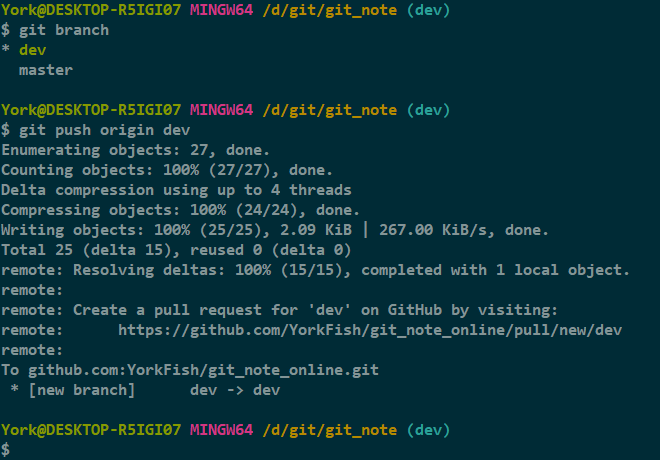

- 既然 *dev* 都推了，那 *master* 也推了吧

    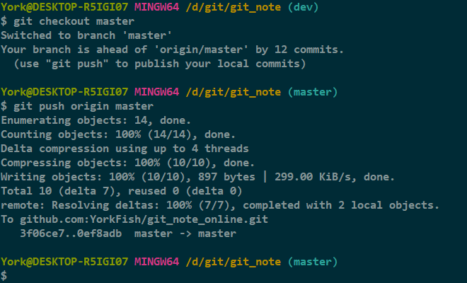

#### 知识点[^1]

> 但是，并不是一定要把本地分支往远程推送，那么，哪些分支需要推送，哪些不需要呢？
>
> - `master` 分支是主分支，因此要时刻与远程同步；
> - `dev` 分支是开发分支，团队所有成员都需要在上面工作，所以也需要与远程同步；
> - `bug` 分支只用于在本地修复 bug，就没必要推到远程了，除非老板要看看你每周到底修复了几个 bug；
> `feature` 分支是否推到远程，取决于你是否和你的小伙伴合作在上面开发。
>
> 总之，就是在 Git 中，分支完全可以在本地自己藏着玩，是否推送，视你的心情而定！

## 3. 拉取分支

### 3.1 一人分饰两角

- 角色介绍

    1. **Windows** 下的 *YorkFish*
    2. **Linux** 下的 *YorkFish*

### 3.2 转到 *Linux*

1. 选一个目录克隆 *git_note_online*

    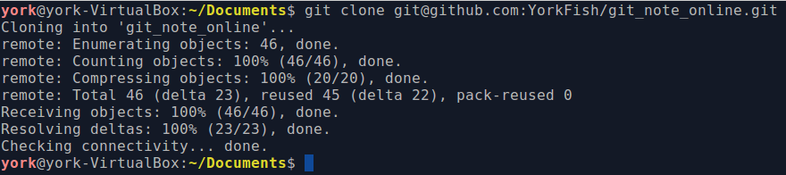

2. 克隆结果：只有 *master* 分支被克隆下来了

    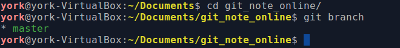

3. `git checkout \-b dev origin/dev`
    - 此命令有三个作用
        1. 创建并切换分支
        2. 与远程仓库关联
        3. 使本地仓库的 *dev* 分支（*dev* 可改）的内容与远程仓库的一致

    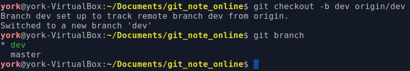

4. 在 *dev* 分支上将 *note_02.txt* 末尾做好标记

    

5. `push` 到远程仓库

    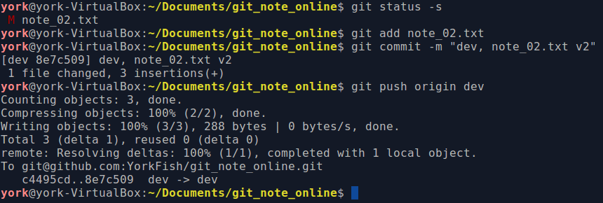

### 3.3 回到 *Windows*

1. 在 *dev* 分支修改 *note_02.txt*

    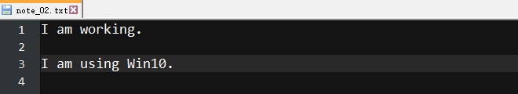

2. `add` + `commit`

    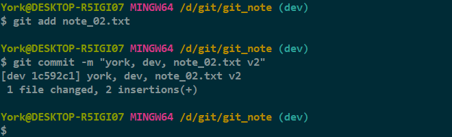

3. `push`

    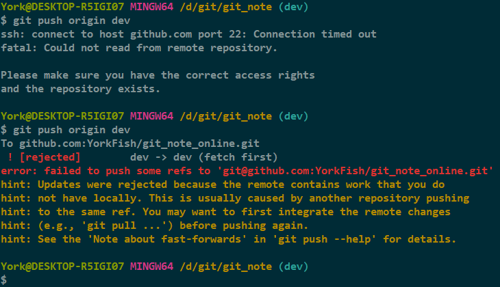

4. `pull`
   - 就像商店门上写的一样，进门要**推**，出门要**拉**

    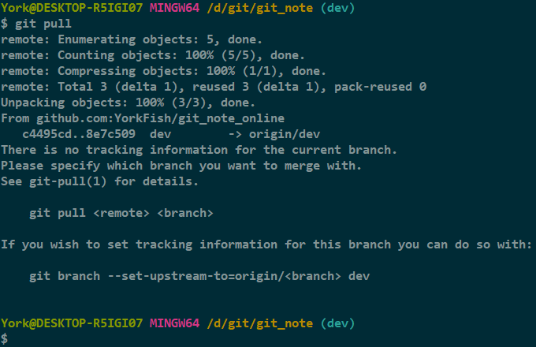

5. 按照提示设置本地 *dev* 分支与远程 *origin/dev* 分支的链接

    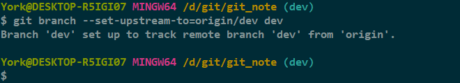

6. `pull` again

    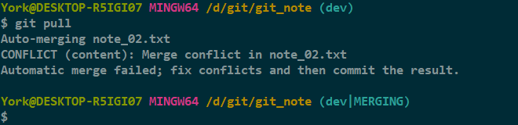

#### 分析

- 第三步
    - 出现了连接超时的现象，这也许是网络不稳定的缘故，我重试后成功连上了
    - 虽然连上，但是冲突了！上一回解决冲突见：<a href="" target="_blank">23_解决冲突</a>
    - *Git* 给出了温馨提示：使用 `git pull ...`
- 第四步
    - *Git* 又给了温馨提示
        1. 没有当前分支的跟踪信息
        2. 若要合并某分支，自行查看更多细节
        3. 若要为当前分支设置跟踪信息，可以使用 `git branch --set-upstream-to=origin/dev dev`
### 3.4 解决冲突

1. 打开 *note_02.txt*

    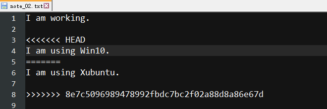

2. “定稿”

    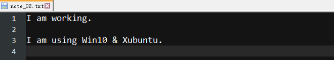

3. `add` + `commit`

    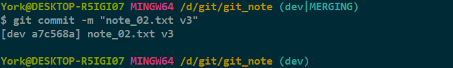

4. `push`

    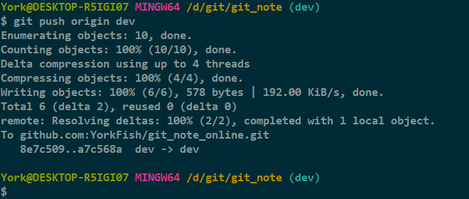

## 4. 小结

- 多人团队在合并分支前一般先 `pull`
- 需要注意与远程分支建立**链接**关系

    

***

[^1]: 这个知识点摘自瘳雪峰老师的《Git教程》