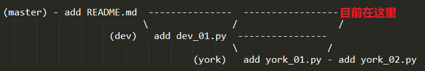
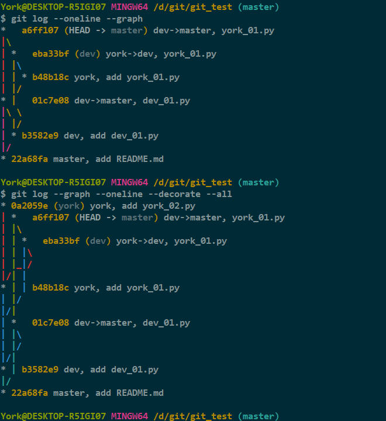
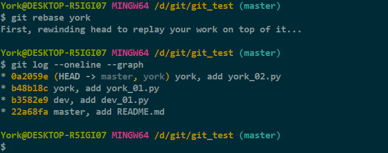
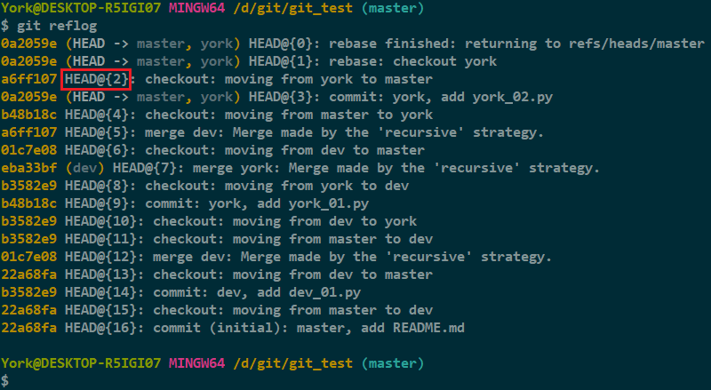
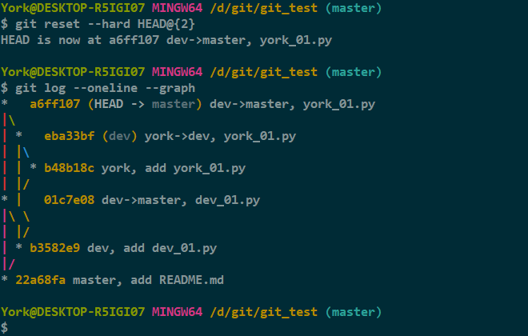

# 29. rebase

## 1. 准备工作

- 为了方便操作，我新建了一个本地仓库，并进行了一些操作
- 当前情况

    

## 2. git log \-\-oneline \-\-graph \-\-decorate \-\-all

- 直观却不明了

    

## 3. git rebase <branch\_name\>

- 只看 `york` 这条线

    

- 没有层级
- `rebase` 操作是把本地未 `push` 的“分叉提交历史”整理成直线，以便查看历史提交的变化

## 4. rebase 的恢复

- 方法不止一种，我暂且介绍一种

1. 使用 `git reflog` 找到 `rebase` 的前一个“指针”

    

2. 使用 `git reset --hard HEAD@{n}`

    

## 5. 补充

- 官方文档传送门：<a href="https://git-scm.com/docs/git-rebase" target="_blank">>>> rebase</a>
- 概要

        git rebase [-i | --interactive] [<options>] [--exec <cmd>] [--onto <newbase>]
            [<upstream> [<branch>]]
        git rebase [-i | --interactive] [<options>] [--exec <cmd>] [--onto <newbase>]
            --root [<branch>]
        git rebase --continue | --skip | --abort | --quit | --edit-todo | --show-current-patch

- 官方文档超详细！有需要搜索即可
