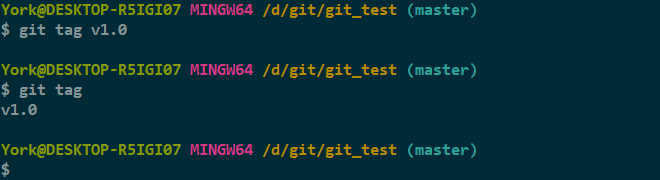
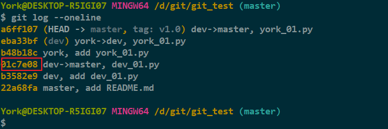
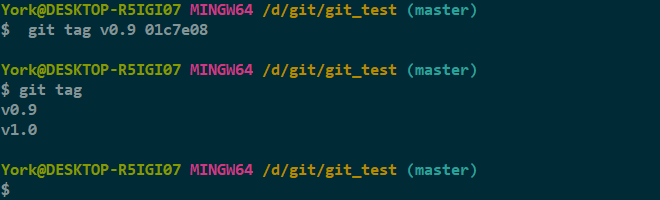
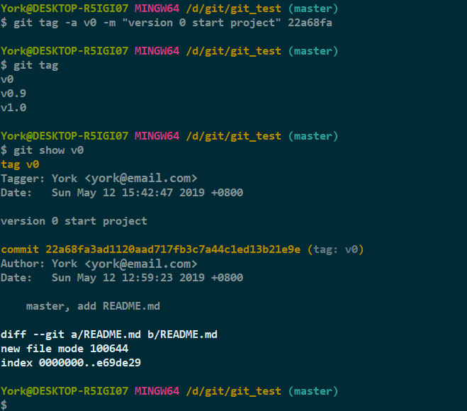
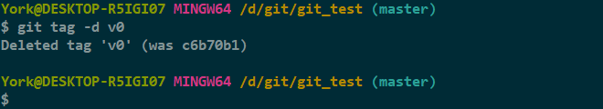

# *tag*

## 1. 我的回忆

- 小时候看《剑花-烟雨-江南》，惊讶于那个拥有多重身份的“小侯爷”
- *Git* 中也可以有“拥有多重身份”的分支，关键就在于这个 `tag` 命令
- 简单地说，*tag* 就是指向某个 *commit* 的指针

## 2. 打标签 & 查看标签

1. 切到要打标签的分支上
2. 使用命令 `git tag <name>` 打标签，`git tag` 查看标签

    

### 说明

- 标签默认打在最新一次的 *commit* 上

## 3. 补标签

1. 查看历史提交信息

    

2. 给哈希值为 **01c7e08** 的记录打标签（*01c7e08* 的操作：将 *dev* 向 *master* 的合并 ）

    

### 说明

- *tag* 是按照字母的顺序排序的

## 4. 查看标签信息

- 使用命令 `git show <tag_name>` 即可

### 参数补充

| 命令 | 释义 |
| :---: | :--- |
| `-a` | 指定标签名 |
| `-m` | 指定说明文字（和 `commit`、`merge --no-ff` 一致） |
| `show` | 显示更详细的信息 |

- 打过标签后，有 *commit* 的地方就有 *tag* 标签
- 颇像《暮光之城》中狼人的“精神烙印”

    

## 5. 删除标签

- 与 *branch* 一样，标签也可以使用 `-d` 删除

### 5.1 标签未同步到远程时

- 使用 `git tag -d <tag_name>` 即可

    

### 5.2 标签已同步到远程时

1. 从本地删除

> york$ git tag -d v0

2. 用 *push* 删除远程的 *tag*

> york$ git push origin :refs/tags/v0

#### 说明

- 操作完后可以登录远程仓库检查一下
- 此法用于单个删除

## 6. 推送标签

### 6.1 推送某个标签到远程

> york$ git push origin <tag_name>

### 6.2 一次性推送全部未推送过的本地标签

> york$ git push origin --tags