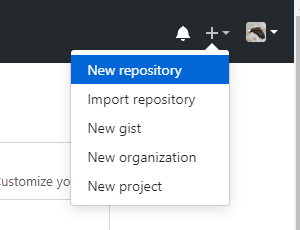
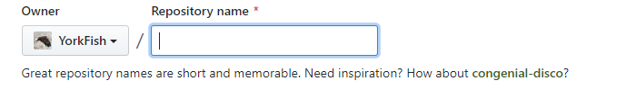
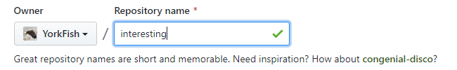
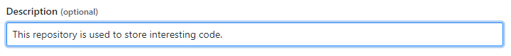
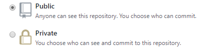
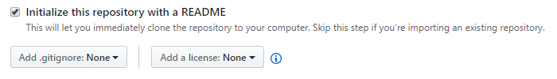
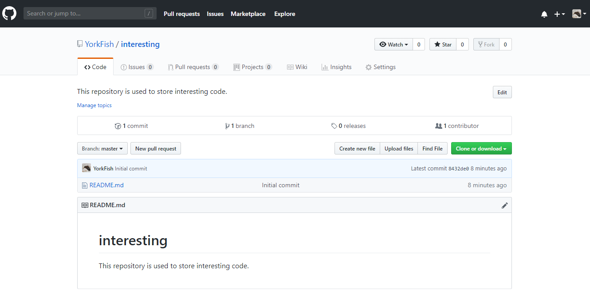

# 1. 在 GitHub 上新建仓库

## 1. 新建

- 点击右上角的 `+`，选择 `New repository`

    

## 2. 取名

1. 网站会自动跳转至新页面，在下框中填入仓库名

    

3. 只要仓库名合法，右侧就会出现绿钩

    

## 3. 仓库简介

- 因为没有红色星号，所以这一栏不是“必填项”
- 虽然可以不写，但还是建议在 `Description` 一栏填入仓库简介

    

!!! tip "修改已有仓库的简介"
    1. 进入目标仓库
    2. 点击右侧 `About` 的齿轮
    3. 在弹出的页面“修改-保存”即可
    4. 若该仓库存的是静态博客，还可为此添加博客网址

## 4. Public or Private

- GitHub 鼓励开源，没有特殊要求，用默认的 `Public` 即可
- 若想使用 `Private`，需支付相应费用

    

## 5. README

- 因为没有红色星号，所以这一栏不是“必填项”
- 即使不选，大概率还是要建的
- 若勾选 `Initialize this repository with a README`，GitHub 会帮忙创建一个 `README.md`

    

## 6. Create repository

- 点击下方按钮

    

## 7. 最终效果

