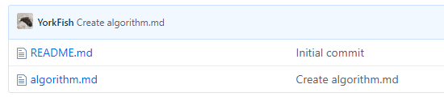
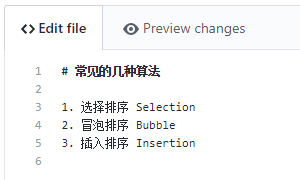
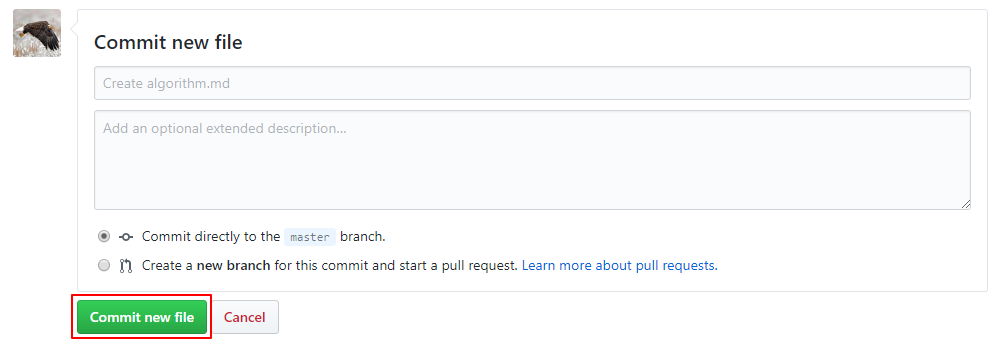
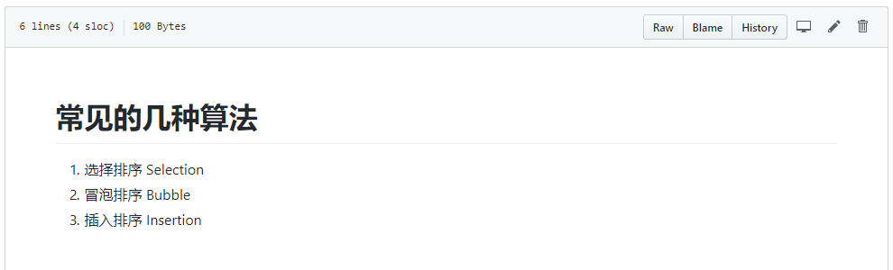

# 2. 往仓库里添加文件

## 1. Create new file

1. 点击右上方的 `Create new file`

    

2. 在左上方填入文件名，若有后缀，记得加上

    

3. 页面跳转，此时已有两个文件

    

## 2. Edit

1. 先点击适才新建的文件
2. 再点击右侧的 `edit`，如下图所示

    

3. 写入文字

    

## 3. Commit new file

- 写完后，下翻页面，点击下方的 <kbd>Commit new file</kbd> 即可

    

- 补充
    - `Create` 与 `Add` 那两个输入框有默认的语句
    - 没有特别要求，可以不改

## 4. 最终效果

- 点击文件名 `algorithm.md`，可以查看文件内容

    
