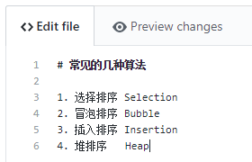
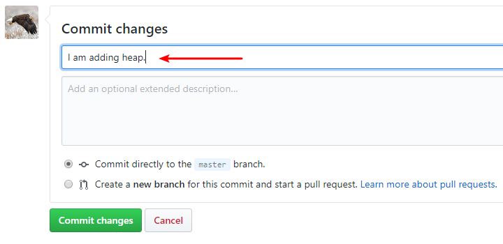
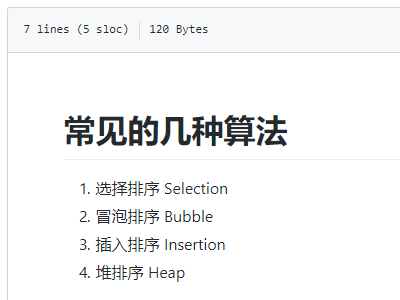
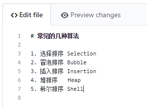
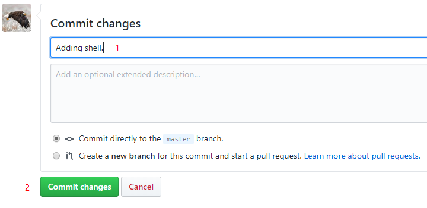

# 3. 修改仓库里的文件

## 1. 选择文件

- 选择仓库中已有的文件，点击右侧的 `edit`

    

## 2. 修改

- 如，在文件中继续写入文字

    

!!! note "小发现"
    - 我只写到第 `6` 行，`commit` 后再点进去，发现多了一行空行
    - 若不想有上述的变化，可以在文末主动多打一个回车

## 3. 做标记

- 自己加一行话作为提醒

    

## 4. 效果

- 点击上图的 <kbd>commit changes</kbd> 完成更改
- 点击文件查看，可见如下效果

    

## 5. 后续操作

- 往后就是重复操作了
- 继续编辑

    

- 标记、提交

    
