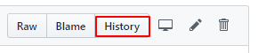
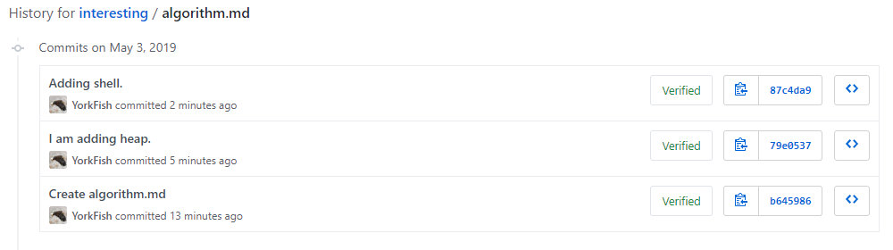
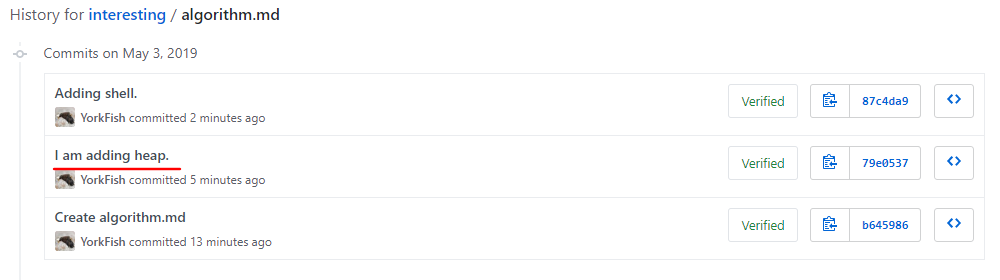
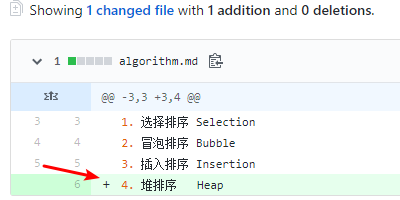
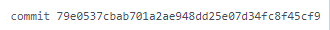

# 查看历史纪录

## 1. 点击右侧的 *History*

- 每个文件都有自己的 *History*

    

## 2. 页面跳转

## 3. 点击相应的 *commit* 标题

- 这是 *commit* 时写的“标记”
- 点击相应的 *commit* 可进入相应版本查看相应的历史
- 如，我选择了 `I am adding heap.`

    

- 点击后出现如下页面

    

- 箭头处说明第 *4* 行是该次 *commit* 时加入的

## 4. 哈希值

- 右侧有一串哈希值

    

- 网址处也有一串哈希值，并且与之相同

    

- 简单地说，这就是个 *id* 号