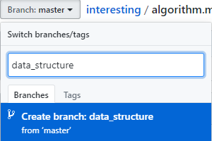
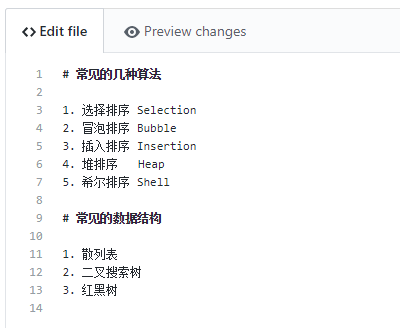
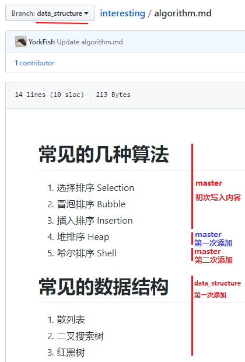

# 5. 创建分支

## 1. 创建

1. 点击左上方的 `Branch: master`
2. 在输入框中填入分支名，如 `data_structure`
3. 点击下方的 `Create branch`

    

- 此时，已经切到了刚刚建立的分支上

    

## 2. 编辑

1. 新添如下文字

    

2. `commit` 时可以看到分支名

    

5. 提交后，效果如下

    
