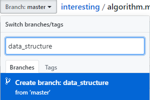
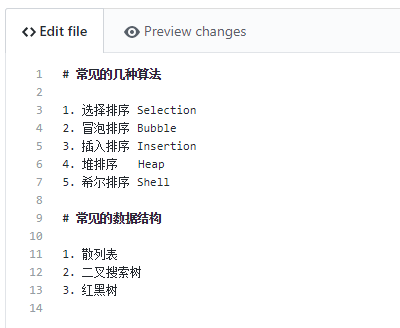
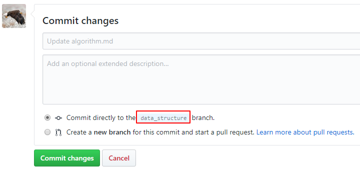
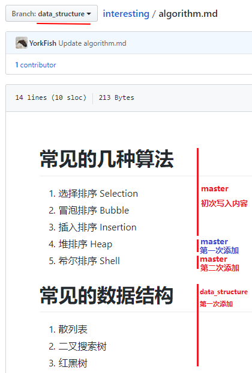
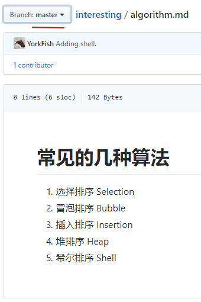

#  创建分支与切换分支

## 1. 创建分支

### 1.1 创建

1. 点击左上方的 `Branch: master`
2. 在输入框中填入分支名，如 *data_structure*
3. 点击下方的 `Create branch`

    

- 此时，已经切到了刚刚建立的分支上

    

### 1.2 在分支的下编辑

1. 新添如下文字

    

2. *commit* 时可以看到分支名

    

5. 提交后，效果如下

    

## 2. 切换分支

### 2.1 左上角找 *Branch*

1. 点击 `Branch`
2. 选择 `Branches`
3. 选择想要切换的分支即可

- 下方两图表示：从 `data_structure` 切到 `master` 的分支
    - 图一

    

    - 图二

    

### 2.2 主分支的内容

- 主分支，即  *master* 分支下的 *algorithm.md* 仍为开分支前的版本

    