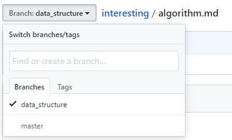
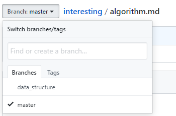
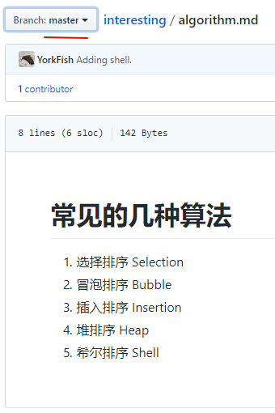

# 6. 切换分支

## 1. 左上角找 Branch

1. 点击 `Branch`
2. 选择 `Branches`
3. 选择想要切换的分支即可
4. `data_structure` 分支

    

5. `master` 分支

    

## 2. 主分支的内容

- 主分支，即 `master` 分支下的 `algorithm.md` 仍为开分支前的版本

    
