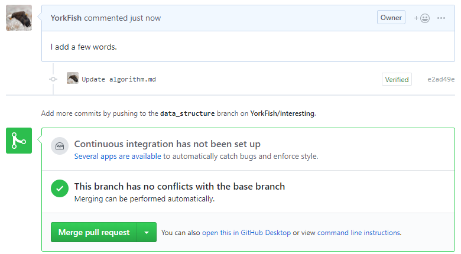
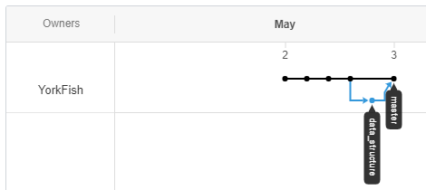
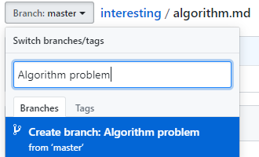
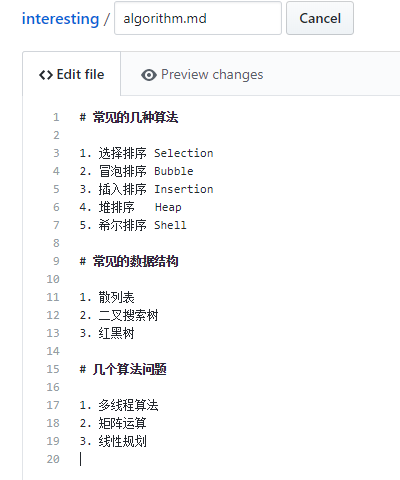
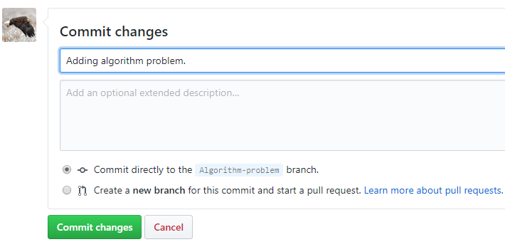
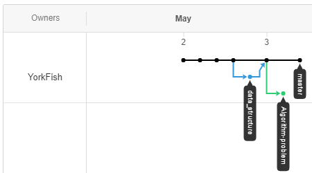
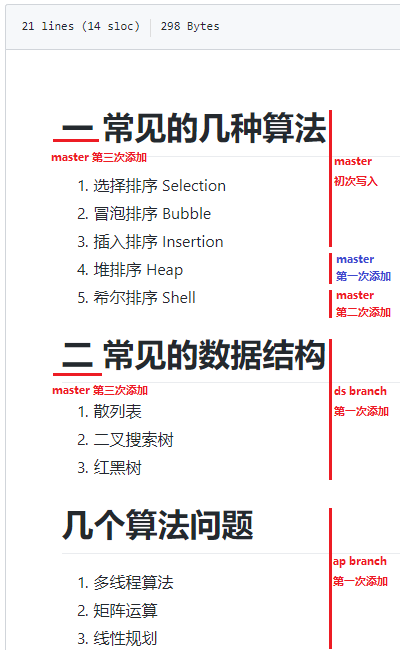
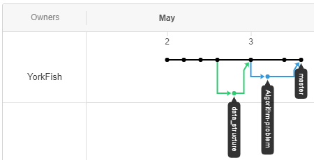

# 合并分支

## 情形一

1. 点击仓库名
2. 点击 <kbd>Compare & pull request</kbd>

    

3. 填写下图 *1* 与 *2*，并点击 <kbd>Create pull request</kbd>

    - *1* 与 *2* 有现成的，想偷懒也可以不写

    

3. 页面跳转如下

    

4. 点击 <kbd>Merge pull request</kbd> 后，该区域变化如下

    - 图一

    

    - 图二

    

5. 点击 <kbd>confirm merge</kbd> 后，该区域变化如下

    

6. 此时再去看图像

    

## 情形二

1. 再建一个分支
    - 小发现：若分支名出现空格，*GitHub* 会自动用 `-` 填补

    

2. 写入内容

    

3. *Commit* (Algorithm-problem)

    

4. 切到主分支，并在主分支上做更改

    - 此更改与刚才分支中的改动不同

    

5. *Commit* (master)

    

6. 此时的图像

    

7. 合并的方法与 “情形一” 相似，仍然分四步

    1. <kbd>Compare & pull request</kbd>
    2. <kbd>Create pull request</kbd>
    3. <kbd>Merge pull request</kbd>
    4. <kbd>Confirm merge</kbd>

8. 此时的文件内容

    
    
9. 此时的图像

    

### 补充

- “情形二”弱化了“解决冲突”
- 相关事项见 <a href="" target="_blank">解决冲突</a>