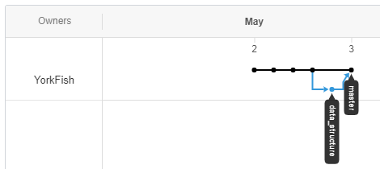

# 8. 合并分支

## 情形一

### 示意

```
o -> o ----> o
     v       ^
      -> o ->
```

### 操作

1. 点击仓库名
2. 点击 <kbd>Compare & pull request</kbd>

    

3. 填写下图 `1` 与 `2`，并点击 <kbd>Create pull request</kbd>，想偷懒也可以不写

    

4. 页面跳转如下

    

5. 点击 <kbd>Merge pull request</kbd>
6. 过度画面

    

7. 完成画面

    

8. 点击 <kbd>confirm merge</kbd> 结束操作

    

### 图像



## 情形二

### 示意

```
o -> o -> o -> o
     v         ^
       -> o ->
```

### 操作

1. 再建一个分支

    

2. 小发现：若分支名出现空格，GitHub 会自动用 `-` 填补
3. 写入内容

    

4. `Commit` (branch: Algorithm-problem)

    

5. 切到主分支，并在主分支上做更改：刚才是添加内容，现在是更改标题

    

6. `Commit` (branch: master)

    

### 图像


### 后续操作

1. <kbd>Compare & pull request</kbd>
2. <kbd>Create pull request</kbd>
3. <kbd>Merge pull request</kbd>
4. <kbd>Confirm merge</kbd>

### 文件内容


 
### 图像


***

## 补充

- **情形二**弱化了“解决冲突”
- 详见 <a href="https://yorkfish.github.io/blogs/git/gitbash/23-conflict-resolution/" target="_blank">23 解决冲突</a>
