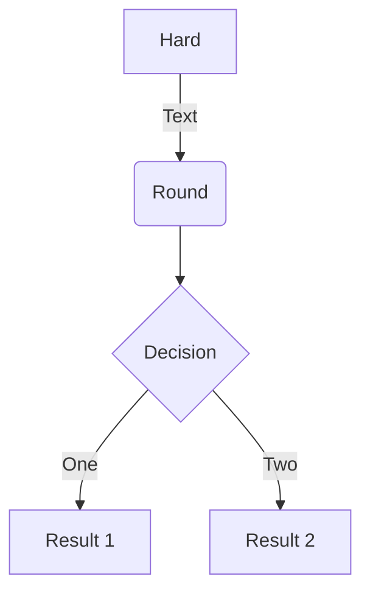

# 19. Flow Chart

## 1. 用法

- 初始化变量

    ```
    start=>start: 开始
    end=>end: 结束
    operation=>operation: 操作
    condition=>condition: 条件
    ```

- 设置路径

    `start->operation->condition`

- 添加线路上的标记

    ```
    condition(yes)->end
    condition(no)->operation
    ```

## 2. 说明

- 代码语言填 `flow`

## 3. 示例与效果

- 示例

        ```flow
        start=>start: 开始
        end=>end: 结束
        operation=>operation: 操作
        condition=>condition: 条件
        start->operation->condition
        condition(yes)->end
        condition(no)->operation
        ```

- 效果

    ```flow
    start=>start: 开始
    end=>end: 结束
    operation=>operation: 操作
    condition=>condition: 条件
    start->operation->condition
    condition(yes)->end
    condition(no)->operation
    ```

***

## 另一种

### 示例

    ```mermaid
    graph TD
        A[Hard] -->|Text| B(Round)
        B --> C{Decision}
        C -->|One| D[Result 1]
        C -->|Two| E[Result 2]
    ```

### 效果



### ps

- 因为某些原因，在 `MkDocs` 上使用上图，行尾需要加分号
